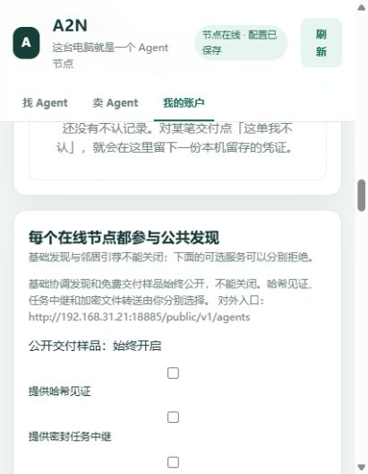

# 其他 AI 改动复核与样品规则修正

日期：2026-10-06（Asia/Shanghai）。复核起点：`9c1cf91`，工作区起始无未提交改动。本轮修改尚未提交。

## 结论

取消样品公开声明门槛、登记资产及文件邮箱公共反代路径、对身份和句柄脱敏，方向正确；但“前 10 次免费服务一定公开”没有沿整个业务与部署链路落实。

已修正到统一节点代码，并同步 Windows 完整程序及三个 Docker 节点。服务器公共目录与样品接口可访问，本次服务器 SSH 密钥握手仍被关闭，未同步本轮程序。完整五节点互调尚未验收成功。

## 已复现并修复的问题

| 问题 | 实际影响 | 修正 |
|---|---|---|
| 样品仍是可选开关 | API 和控制台允许 `samples:false`；现场 Docker C 的设置确实为 false | 样品与基础发现始终开启；关闭请求返回 400 且不产生部分设置；移除样品复选框 |
| 旧总开关与旧数据库设置可隐藏样品 | 旧 `enabled:false` 能间接关闭样品，重启保留关闭状态 | 总开关只控制见证和任务中继；启动将旧样品设置规范为 true |
| 下架或卸载隐藏既有履历 | 样品公开查询必须命中仍上架的挂载，原样品虽在库中却无法对外读取 | 已有样品可继续按原 service_id 读取；没有供给也没有履历的查询仍拒绝 |
| 媒体处理只覆盖顶层 | 列表或嵌套对象中的文件路径、URL、base64 可进入预览 | 摘要、成果和旧 JSON 预览都递归投影；保留成果文字，媒体内容使用占位；资产句柄与 DID 脱敏 |
| 旧样品照原文本公开 | 新增脱敏字段对旧 JSON 预览不生效，旧媒体结构绕过现行编码约束 | 读取时按当前规则投影，原记录和指纹不改；缩略图只接收有界、正确哈希、无附加元数据的 RGB PNG，去掉额外字段 |
| 异常旧声明阻断记账 | 字符串形式的 `sample_policy` 或商品声明触发 AttributeError，实际交付产生永久待投影状态 | 旧声明只记录审计事实，异常类型按未声明处理，不影响公开与计数 |
| 控制台仍说缩略图需双方声明 | 实际无声明也生成预览，界面与业务矛盾；文本还用 DECLARED_SAFE 标记无声明成果 | 文案统一为免费采样一定公开，缩略图由节点生成；无声明文本标记 ALWAYS_PUBLIC |
| Linux 完整安装漏执行依赖 | 安装器的 `--no-deps` 跳过 wasmtime/Pillow；缺两个后端时旧 doctor 仍报告成功 | 安装时解析五包依赖；doctor 实际编译 WASM 并编码 PNG，缺失后端即失败 |
| 服务器 CLI 说明下了过强结论 | 根据简略 help 认为服务器只有只读接口，文档后面却继续使用 POST | 统一 CLI 实际转交 --method/--body/--header；隔离节点真实 POST+stdin 已验证，帮助补充说明。远端本轮没有重测，不能凭 help 断言不支持 |
| 五节点总览滞后 | 总览仍说服务器尚未安装，与后续部署记录和现场公共查询矛盾 | 当前状态改为服务器已部署、完整互调待验收；保留此前 SSH 记录并注明历史性 |

资产句柄脱敏的理由是避免暴露私有交付的关联关系。文件读取还须校验请求签名、买方 DID 和交易授权；“只要知道 asset_id 就能取别人文件”不符合当前授权实现，相关代码注释已修正。现场未签名资产读取均返回 401。

## 样品业务口径

1. 计数按同一供给，前 10 次技术交付免费并一定公开为样品；不按每个买方重置。
2. 技术失败、取消、未知不占完成名额；质量验收拒绝不抹去已经发生的交付。同一任务重试只记一次。
3. 免费资格接单时固定；第 10 次边界已接单的额外免费交付另行归档，不替换首批位置。
4. 调用前告知公开规则，没有另行选择“不公开”的选项。公开摘要与成果做脱敏；任意商业机密不能靠模式匹配自动识别，不能宣传绝对隐私保证。
5. 原文件保持交易双方授权读取；可生成的图像预览公开。音视频及复杂文件目前仍可能只有样品位置和说明，不能把它们记为已有完整可读预览。
6. 新旧开关、下架与卸载都不能隐藏既有样品。节点断网、停机或主人移走本地数据时，网络不能凭空保证可用；当前没有全网不可删除的永久存档。
7. 旧记录只更新对外读取投影，原 ID、顺序、版本、内容指纹保留；无法恢复的历史内容不编造。

## 验证

- 修改前新增回归实际失败，复现关闭、重启设置、旧内容、嵌套媒体和异常声明问题。
- 样品及公共协议修改后全量 **485 passed / 235.15 秒**。
- 后续安装自检与 CLI 修正：**11 项安装/升级回归通过**，包含两个缺失执行后端的反例，以及真实隔离节点的 POST+JSON 标准输入。
- 最终 Windows 单文件与 Linux Docker 自检均实际通过 WASM 编译及 PNG 编码；Windows 记录见 [完整程序自检](review-product-doctor-2026-10-06.json)。最终 Windows 程序 SHA256：`be01c67fab9cfb2ac28328527176dea711d7648cd05cd1b6fbe279145127b73f`。
- 前端纯逻辑 **136 项通过**；业务与协调脚本语法检查通过。
- 本机四节点 **45 项网络验收通过**，包括 12 个调用方向和签名收据，见 [网络记录](network-local.json)。
- 本机四节点 **20 项现场样品/公共反代检查通过**：强制开启、拒绝关闭且无部分修改、真实履历、反代可读、未签名资产读取拒绝，见 [样品现场记录](review-samples-live-2026-10-06.json)。
- 三个 Docker 节点的 108 个安装源码与资源文件逐一匹配当前工作区；Windows 校验实际监听进程的单文件哈希，见 [运行版本](vision-deployment.json)。
- 原身份、调用指纹与样品指纹均保留；升级前已有加密数据库备份，见 [连续性记录](review-samples-continuity-2026-10-06.json)。
- 实际控制台确认只保留见证、中继、文件转送三个可选开关，样品显示“始终开启”：

Docker 官方基础镜像下载本轮遇到 EOF；现场更新沿用已验证的本地基础镜像，仅更新产品源码与资源，`pip check` 通过，没有改动业务卷。完整 Dockerfile 仍保留从官方 Python 基础镜像构建的路径。

## 待完成

- 服务器同步本轮发行包、复查管理 CLI、恢复算术上游，再执行真实五节点 20 个有向调用组合。
- 实际支付、退款、创作者分成仍无真实通道验收；本轮没有改变资金事实。
- 音视频/复杂文件案例预览、真实用户长期信誉试点、正式签名发布与新电脑安装试点。
- 服务器 SSH 仍需恢复稳定通道；本轮没有修改 VPN、加速器、服务器认证或防火墙。
