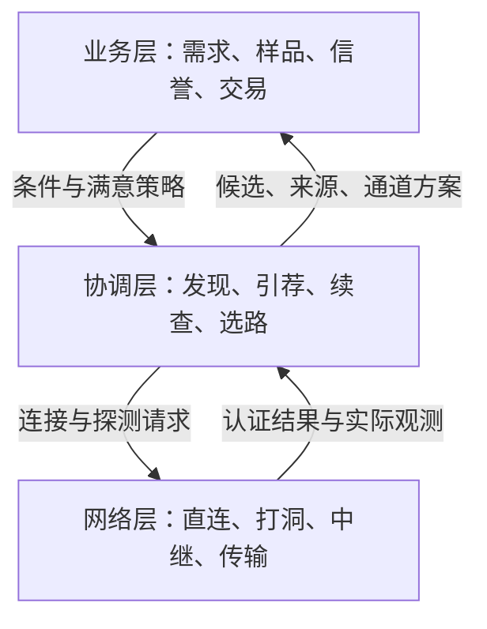

# A2N 协调层规则

版本：v0.1 · 2026-09-29 建立，2026-09-30 补充接口契约。性质：供开发与验收使用的规则设计稿。**第 16 节 C0（契约与稳定身份）已于 2026-10-01 落地**（接口与签名原语，见下）；其余批次仍为实现前的设计。

本轮已确认的产品方向：所有在线入网节点共同承担公共发现；A 可从 B 获得 C、D、E 的线索并逐级探索；调用方认为满意就停止，不满意可以继续；发现过程中积累通道信息并优化后续连接。发起人进一步明确：**发现属于网络层与业务层之间的协调层。**

本文把以上方向转成可执行规则。文中的“必须／不得”是本设计的约束，“建议”是实现建议；数值参数与消息字段是 v0.1 建议值，需经试点验证。新方向替代旧文档中“公共发现可随意关闭”的目标设定；旧版本代码的开关、接口和实际能力仍按现状记录。业务规则继续遵循 [VISION.md](VISION.md)：公益、零交易抽成、重信誉轻证据、前 10 次免费调用默认形成样品。

## 1. 目标与边界

协调层的目标是：**在调用方可承受的探索成本内，找到足够合适、信息有来源、存在可用通道的供给，并保留继续探索的能力。**

协调层不承诺全网完整目录、全网最佳商品或全网最短路径。一次搜索的结果是当前调用方在当时信息、预算和偏好下获得的候选集合。

### 1.1 三层职责

| 层 | 负责 | 对相邻层提供什么 |
|---|---|---|
| 业务层 | 商品描述、定价、免费试用、样品、双方评价、信誉、接单条件、验收与结算 | 公开业务摘要；本地筛选／排序／满意策略；开始交易前的最终确认 |
| 协调层 | 入网协作、节点引荐、逐级发现、候选核验与去重、暂停续查、获取样品与反馈摘要的线索、通道选择 | 带来源和时效的候选；搜索进度；可用通道方案及限制 |
| 网络层 | 连接、加密与身份握手、直连、打洞、中继、传输、连接故障与测量 | 已认证会话；实际可达状态；时延、错误和字节消耗等观测 |

业务层向协调层发出“找什么、哪些条件必须满足、何时算够用”；协调层安排查询与验证；网络层执行连接和传输。最终是否调用、按什么价格成交，由业务层决定。

业务确认可以按用户预先授权的价格、预算与信任规则自动完成，不要求每笔人工点击或签署材料。协调层只能交付候选与通道，不能自行扩大授权或成交。

协调层必须保留以下边界：

- 不执行买方任务来做发现测试，不消费试用次数，不修改价格或免费额度，不扣钱。
- 不写入商品质量分、买方诚信分，不裁定交易纠纷，不把网络连接成功写成业务验收通过。
- 可读取和传递已公开、带来源的业务摘要，并调用本地业务策略评价候选；不得执行陌生节点提供的代码或评价策略。
- 发现、样品浏览、路径探测都不产生一笔交易；交易由业务层显式启动。
- 发现层使用的信息版本，必须与实际准备调用的商品和通道可对应；成交前业务层再次确认价格、试用状态、版本及接单条件。

### 1.2 三种身份分别保存

1. 节点身份：`node_did`，标识谁发布、转发或回答信息。
2. 商品身份：`(provider_did, service_id)`，标识谁负责的哪一份供给；地址、端口、描述、价格和版本变化不得自动改变商品身份。
3. 通道身份：`route_id`，标识到该商品的一种连接方案；同一商品可以有多个通道。

Card 的内容哈希用于区分声明，不作为商品永久身份。多个 DID 不等于多个独立自然人。商品版本由供给者声明，协调层不自行判断两个版本质量等价。

## 2. 所有在线节点的公共义务

### 2.1 最低职责

使用新协调协议在线参与网络的节点，必须提供以下能力：

| 职责 | 最低要求 |
|---|---|
| 接受发现请求 | 在已认证连接或安全的公共入口上处理有界查询，明确返回结果或状态 |
| 声明自身公开供给 | 返回启用且允许公开的商品线索；没有供给也可正常参与 |
| 引荐相关节点 | 返回自己已知、仍有效、允许转发的相关节点记录，说明信息来源和时间 |
| 协助访问 | 对已建立且允许协作的邻居连接，在额度内转送指向明确目标的小型协调消息；这是基础义务。打洞协助等额外方式按实际能力声明 |
| 管理缓存 | 去重、标记过期、限制体积、保留原始发布者，不把转发信息重新冒充自有供给 |
| 如实反馈 | 返回限流、繁忙、暂不可达、不支持等明确状态 |

正常在线状态下不得配置为“只使用别人的发现能力、永久拒绝全部公共查询”。节点可以离线，也可以暂停销售自己的 Agent；暂停销售不会关闭其在线协调职责。

这些是协议参与规则，不能保证任意修改过的软件都诚实履行。对异常节点，由各节点根据观测调整连接与查询选择，不设一个控制全网入场或封禁的中央角色。

### 2.2 资源与隐私边界

每个节点必须实行本机总额度和按连接／身份划分的额度。资源不足时可返回 `BUSY` 或 `RATE_LIMITED`，附建议重试时间；达到本机额度可以暂缓协作，不要求永久在线或无限贡献算力、带宽和存储。

在线参与时，公共协调预算必须为正，并以公平调度避免只服务本机请求、长期饿死邻居请求。不得把额度设为零或以无期限 `BUSY` 代替协议参与。临时拒绝应有有限重试时间；长期有效应答率只影响其他节点如何选择协作对象，不能据此直接扣业务信誉。真实资源耗尽时仍以保护本机为先。

强制发现职责只覆盖公开信息和有界协调消息。完整任务数据中继、大文件缓存、收据见证等能力单独声明资源额度；其中涉及实际费用时，必须在使用前由业务层确认。A2N 不以发现、曝光或排名收取费用。

私有账户、凭据、钱包余额、任务原文、完整输入输出、私人收藏及完整连接历史不得因参与发现自动公开。公共邻居引荐只包含可转发的节点记录，不公开本机全部邻居表。

## 3. 入网、内网节点与退出

1. 首次入网至少需要一个入口：局域网发现、用户提供的节点地址，或预置的多个独立引导入口。
2. 握手确认节点身份、协议版本、可提供的协调操作、消息大小上限与连接方式。能力声明必须能与已认证身份对应。
3. 入网后按需引荐更多节点，维护数量有上限、来源尽量分散的邻居集合；发现过的所有节点不必同时保持连接。
4. 无法接入时显示 `ISOLATED`。不得把没有邻居解释成市场没有供给。
5. 内网节点通过主动建立的会话接收并回答协调请求。若必须借助中继，须有专门的协调消息通道或带来源的目录快照；已有任务中继能力不能自动视为支持协调请求。
6. 经缓存返回的内网节点信息，必须标为缓存、带观测时间；不冒称目标实时在线。
7. 正常退出可发送下线通知，异常断线通过超时失效。离线不清除业务信誉、试用次数或商品历史。

引导入口负责接入介绍，没有商品审批、排名或最终评价权。内网限制、设备休眠与短暂故障不自动构成业务不诚信。

## 4. 协调信息模型

下表为逻辑模型；字段命名可在协议实现时统一，但语义必须保留。

| 对象 | 最少信息 | 约束 |
|---|---|---|
| 节点记录 `NodeRecord` | DID、协议版本、可联系的协调端点或中继会话描述、支持操作、签发与到期时间、签名 | 节点自行声明；第三方引荐须保留声明者 |
| 引荐 `Referral` | 引荐者 DID、目标节点记录及其哈希、相关能力、线索类型、观测时间、到期时间、引荐者签名 | 签名绑定这些字段；二次转发保留原始声明。仅表示提供线索，不能据此认定目标在线或服务质量合格 |
| 供给线索 `OfferHint` | provider DID、稳定 service ID、能力标签、Card 获取引用、Card 哈希、来源、时间 | 仅作查询线索；尚未验签的线索不进入可调用集合 |
| 已核验供给 `Candidate` | 稳定商品键、已核验的 Card、描述／样品／反馈引用、版本信息、核验状态、来源集合 | 同商品多来源合并，保留来源差异和多个通道 |
| 通道 `RouteDescriptor` | 目标商品键、`channel_type`、目标方签名的通道 Card 或授权及哈希、相关中继、有效期 | 不允许引荐者任意替换目标商品的调用 URL；通道类型须与实际传输协议对应 |
| 通道观测 `RouteObservation` | 测量者、目标、通道、时间、探测方式、往返耗时、成功／失败、样本数 | 区分本机实测、第三方报告与自报；声明不冒充测量 |
| 搜索会话 `SearchSession` | 本地条件、策略版本、已访问状态、待查队列、分页游标、候选、预算、状态 | 本机持有；不要求向外公开完整搜索历史与偏好 |

签名证明声明来源与完整性，不保证声明中的能力、价格或信誉摘要一定真实。引荐记录不能替代供给方的 Card 验证。

引荐线索类型须区分“我直接观察过”和“我转收到”。目标节点的自签记录只证明其发布过声明，不证明引荐者曾实际连接它；引荐者的签名也不自动证明其观测属实。仅在一次认证会话内使用的应答可由会话绑定来源，需要缓存或再转发的引荐必须保留可独立核验的签名。

同一商品的直连 Card 与中继 Card 可以有不同哈希；协调层应按稳定商品键分组，保留各自经过验证的通道绑定。只在存在可验证的版本规则时判断新旧，不能仅按到达先后覆盖。

## 5. 发现请求与本地业务策略

### 5.1 本地输入

业务层应给协调层提供：

- 需要的能力，以及可明确校验的必要条件。
- 可选偏好：价格范围、语言、格式、样品要求、信誉表现、交付期限等。
- 满意策略：人工选择，或本地策略判断“合格候选数量／质量已达到要求”。
- 探索预算和是否允许自动进行下一轮；默认一轮结束后停下。

价格、试用、支付可用性等由业务层解释。缺少价格不能自动当作零价；缺少信誉不能自动当作差评；缺少信息应标明并允许继续获取。

### 5.2 对外最少披露

对外发现请求默认只包含能力标识、必要的粗粒度条件、页大小、请求标识、有效期。买方完整需求、提示词、精确预算上限、私人偏好、账户信息和满意策略留在本机。

业务层可以允许披露额外的公开筛选字段，但不得通过“搜索方便”绕过私有数据边界。样品只按需读取已经允许公开的预览，不随所有发现请求批量传播。

## 6. 逐级发现算法

### 6.1 发起节点持有搜索控制权

A 是本次搜索的调度者。B 收到查询后返回自己已知的一页候选及引荐；**v0.1 的查询应答不触发 B 自主向下游递归扩散。** A 根据应答决定下一步问谁。

若 A 需要经 B 联系内网 C，A 明确指定 C，由 B 在已建立且允许协作的连接及额度内转送该请求。B 不把一个查询复制给全部邻居。控制消息转送仍计入资源限制，与“B 代替 A 无限搜索”分开。

### 6.2 一轮搜索

1. 创建本地 `search_id`，冻结本轮条件与策略版本，加载有效缓存和可用入口。
2. 待查队列按相关性、来源多样性、近期可达性与公平轮转选择少量节点。
3. 发出每个远程请求前预留本轮请求与并发额度；无额度时不发送。
4. 接收一页结果，先做大小、格式、时效及身份校验，再保存线索。
5. 将可验证的新节点加入待查队列；同一节点由多个来源引荐时合并来源，避免重复扩张。
6. 按需获取供给方 Card，验签并绑定稳定商品身份。对符合本地初筛的候选读取必要公开摘要、探测通道。
7. 业务策略重新评估候选与满意条件。满足则停止派发新请求；否则在剩余额度内继续。
8. 达到时间、请求、字节、深度等任一上限时结束本轮，保存可继续的位置并返回明确原因。

A 只保存足够完成本次探索的有限局部图；不要求同步全网拓扑。引荐深度是线索传播层数，调用跳数是实际通道经过的中继数，两者分别记录。

### 6.3 去重与防环

- 网络请求按 `request_id` 做短期去重；重复请求使用原响应或明确表示已处理。
- 节点访问按 `(node_did, query_fingerprint, snapshot_revision, page_cursor)` 记录，允许读取不同页；不能只靠“这个 DID 见过”跳过其后续页面。
- 待查节点、来源链路分别去重；A→B→C→A 的引荐不会再次扩增 A。
- 商品按 `(provider_did, service_id)` 合并；版本、来源、通道分别保存。
- 以多个假身份绕过限制的风险仍由每连接／来源与本机总额度共同约束；不能宣称 DID 数量等于独立参与者数量。

### 6.4 分页与断点

返回结果必须有大小上限。分页游标绑定应答节点、请求条件、快照版本、页大小、有效期；私有会话游标还须绑定请求者。游标是继续读取的凭证，不是业务授权。

A 保存一页数据、去重状态及下一页游标时应一致提交。崩溃重启后，已预留但无法确认是否发出的请求按已消耗处理；不得因为重启获得额外额度。重复读取不会重复增加候选数量。

游标过期时返回 `CURSOR_EXPIRED`。A 可以重新读取该节点，并依靠候选去重恢复进度；不得把失效游标解释成该节点没有供给。

## 7. 停止、继续与状态

| 状态 | 含义 | 后续动作 |
|---|---|---|
| `CREATED` | 本地会话已建，尚未派发 | 开始搜索 |
| `RUNNING` | 正在查询、验证或探测 | 可暂停或结束 |
| `SATISFIED` | 本地业务策略或用户认为已有足够候选 | 可使用结果，也可继续探索 |
| `PAUSED` | 用户主动暂停 | 保存队列与候选，可继续 |
| `BUDGET_REACHED` | 本轮任一额度耗尽 | 显示已用额度和部分结果，可追加下一轮 |
| `FRONTIER_EXHAUSTED` | 当前已知且允许探索的队列已用完 | 可添加入口、调整条件，或稍后刷新 |
| `ISOLATED` | 没有可用入口 | 接入至少一个节点后再开始 |
| `CANCELLED` | 本次搜索明确结束 | 保留已允许保存的缓存，续查需新会话 |
| `EXPIRED` | 会话保存期限到期 | 新建搜索，有效缓存可复用 |

`SATISFIED` 由 A 决定，B 无权替 A 宣告“已经足够”。达到满意条件后保留未探索队列，点击继续会增加一轮明确预算；不会偷偷扩大价格范围、降低身份要求或改变原业务条件。

暂停和停止首先阻止新的派发，尝试取消尚未完成的协调请求；已经发出的少量响应可在剩余接收限制内入库，不能触发新的查询。搜索取消不取消任何已创建的业务任务。

修改能力或必要条件时新建搜索条件版本，重新评估已有候选；相关缓存可以复用，原筛选结论不能直接沿用。自动代理的多轮搜索必须预先有总预算，不能因为用户没有操作就无限继续。

## 8. 候选核验、样品与公平

每个候选分别展示以下状态，不用一个“可信”标记混在一起：

1. 来源是否可验证；发布者是否与商品身份一致。
2. Card 是否有效、是否过期或存在声明冲突。
3. 样品与反馈是否可取、来源是什么、覆盖多少记录。
4. 当前有没有测得可用的调用通道。
5. 是否满足买方本地业务条件；哪些信息仍然未知。

同一节点返回很多商品不能自动挤掉其他来源。搜索队列须保留跨来源轮转与新节点探索机会；推荐顺序由本地策略决定，不按中继贡献、支付曝光费或响应包大小分配商业排名。

缺少评价的新 Agent 标为信息不足，符合必要条件时仍可进入探索集合。明确不可用或无效的记录不进入自动调用集合，可保留诊断原因。业务方可自行屏蔽节点或商品，协调层须尊重。

公开样品按稳定商品与版本关联，只取业务层发布的安全预览。无样品、样品暂不可达、内容被隐去必须分别表达。只看见卖方提供的反馈摘要，不能推断其没有负面评价。

协调层不改变前 10 次免费服务默认形成样品的规则，也不把搜索、探测或浏览样品计为一次免费调用。

## 9. 通道发现与优化

### 9.1 路径的含义

引荐 A→B→E 表示 A 经 B 得知 E；不能据此推断 B 能转发 A 到 E 的业务任务。通道方案必须有明确的传输方式、目标授权、可达性与有效期。

推荐初期支持同一商品的两类方案：供给方签名的直连 Card、供给方签名的中继 Card。多中继链在各跳协议、授权、额度与端到端保护都支持后再纳入；不能把已知邻接边随意拼成一个可执行通道。

### 9.2 建立与验证

1. 引荐给出的 URL 作为线索处理。拉取时限制目标地址类别、协议、重定向、响应大小、超时与 DNS 解析变化。
2. 公网节点提供的引荐不得驱动本机访问回环、管理口或未授权内网地址；用户明确配置的本机／局域网连接保留独立的授权范围。
3. 验证通道与目标方身份、商品和 Card 绑定。中继需要验证目标已注册或授权，不接受第三方任意改写 URL。
4. 使用不执行业务任务的控制探测或安全元数据请求确认通道。仅 TCP 握手成功不能视为目标协议可用。
5. NAT 会合、UDP 打洞成功与 HTTP/A2A 任务可达分别验证；不得把控制层打洞成功写成业务通道已打通。

协调入口的 `PROBE` 成功仅证明协调口响应。业务通道须用相应协议的安全元数据或控制操作单独验证；若协议没有这种操作，应标为尚未验证，不能自动执行一次真实任务来探测。

### 9.3 选择规则

先排除身份／授权不符、已过期、已知不可达或超出业务允许成本的方案，再在剩余方案中比较：

- 本机测得的端到端往返耗时及波动。
- 近期成功率、超时率、样本量与测量时间。
- 实际中继数、可用带宽及已经明示的成本。
- 请求的业务约束，例如时限或大文件传输需要。

v0.1 建议先用可解释的分层比较：满足必要条件 → 在有足够新鲜测量时比较稳定性 → 时延 → 成本与跳数。样本不足单独标记并做有限探测；具体偏好由本地策略配置。

控制探测不能代表 Agent 推理时间，多个链路的 RTT 不能简单相加冒充业务端到端耗时。第三方报告只用于安排探测优先级，不能直接覆盖本机实测。

发现新线索后，按探测额度验证有价值的候选通道；确认更合适时更新本地通道方案。结果称为**当前已知、已验证条件下的优选通道**。没有改善时继续使用现有方案，不承诺每轮必然缩短路径。

### 9.4 切换与任务安全

新任务使用更新后的方案。在执行中的任务绑定原有身份、商品、任务 ID、授权和任务控制通道；发现更好路径不自动迁移正在执行的任务。

业务任务建立时应持久保存目标商品键、所选 Card 及哈希、`channel_type`、传输适配器／`route_name`、本地任务 ID 与远端任务 ID。传输适配器必须匹配已声明的通道类型，不能将同一个中继 URL 任意改按直连协议尝试；不同本地投影的同名任务 ID 也不自动构成跨通道幂等。

调用发送前已确认连接失败，可在同等授权与业务条件下尝试其他方案。请求已发出而结果未知时，必须先查询原任务状态；不得为“换条更快的路”重新执行一遍。只有协议支持并确认同一任务幂等与控制权迁移，才可变更任务控制通道。

签名、权限或协议校验失败，不得降级到更弱身份校验的通道绕过失败。搜索优化不改变交易价格，也不触发自动付款。

## 10. 缓存、时效与稳定身份

| 信息 | 缓存原则 |
|---|---|
| 节点引荐 | 短期保存，附引荐者与最近观测时间；失效后只作待刷新线索 |
| Card | 保留签名与内容哈希；尊重发布者有效期，并叠加本地刷新上限 |
| 通道测量 | 短期有效；连接重建、网络变化、连续失败后提前失效 |
| 样品与反馈摘要 | 保留商品、版本、来源、更新时间与覆盖范围；不冒充全量历史 |
| 未找到结果 | 只对该来源、该条件、该时间窗口有效，短期缓存 |
| 搜索会话 | 有保存期限与总量上限；保留部分进度，重启后验证连接及游标再继续 |

地址变化只更新通道，描述与价格变化更新声明，版本变化保留旧样品和商品身份。所有来源上的同一商品都可以合并；发现不能通过重新导入创建一份“没有历史的新卖方”。

对于旧收藏指向失效地址：先按稳定身份寻找新的签名通道，向本地投影提供刷新建议；找不到时显示“原通道失效，尚未找到新通道”，不得偷偷替换为同名的其他卖方。

## 11. 资源预算与建议初值

额度必须由 A 统一计算。每个子请求只能使用已分配的一部分额度，不能把完整预算复制给多个下游。应答节点仍执行自己的本机总额度，任何远端签名都不能绕过本机限流。

**以下数值仅为 v0.1 试点建议，必须配置化、记录策略版本，不能当作已经实测可支撑的容量。**

| 参数 | 建议初值 | 达到后 |
|---|---|---|
| 一轮总时间 | 5 秒，含查询、拉卡和主动探测 | 返回部分结果与继续入口 |
| 一轮远程操作总次数 | 24 次，连接、查询、拉卡、探测均纳入可计量额度 | 停止派发 |
| 同时进行的远程操作 | 3 个 | 排队 |
| 单条协调转送通道 | 建议最多 4 个中间节点，各跳均须已有可验证的协作连接 | 返回不支持该通道；A 可寻找其他入口 |
| 初始引荐深度 | 3 层；继续时可增加，单会话安全上限建议 16 层 | 保留超出范围的线索 |
| 一页引荐／供给线索 | 各最多 8 条／10 条，同时受字节上限约束 | 使用游标 |
| 单响应／一轮接收量 | 64 KiB／1 MiB；完整样品附件另按需获取 | 中止超额读取，记录原因 |
| 待查队列／候选集合 | 256 个节点／256 个商品 | 多样性轮转、淘汰重复和过期记录，显示截断 |
| 单会话访问记录 | 1024 条分页访问记录 | 要求结束会话或明确重新探索 |
| 同时活跃搜索 | 每本机 2 个，受本机总额度约束 | 排队或明确拒绝 |
| 每个已认证邻居请求速率 | 每秒 1 次，短时突发 4 次 | `RATE_LIMITED` 与退避 |
| 本机协调请求速率 | 每秒 8 次，短时突发 16 次 | `BUSY` 与退避；部署前按机器实测调整 |
| 引荐／Card 本地刷新上限 | 5 分钟；若声明先过期则提前失效 | 重新验证 |
| 通道实测有效期／失败退避 | 60 秒／从 5 秒递增到最多 60 秒 | 有限重探，不紧密重试 |
| 搜索会话保存期 | 30 分钟 | `EXPIRED`；有效缓存仍可复用 |

签名校验、握手和无效报文也消耗资源，网络入口须限制报文大小及未认证连接，不能等进入业务查询后才限流。达到服务额度与发现失败应分开统计。

## 12. 协作质量与业务信誉

协调层可记录本机观察到的查询响应率、线索有效率、过期率、限流状态和连接稳定性，用于选择下次问谁、走哪条路。

这些指标不得直接增加或扣除 Agent 的交付质量分、买方付款信誉，也不得兑换商业曝光。高带宽节点没有天然的商品排名特权。

已知伪造身份、非法地址引导、持续发送超额消息等行为，可以触发本地丢弃、退避、减少引荐权重或断开连接。暂时离线、繁忙、样本不足与正常隐私限制，不直接定性为恶意。

第三方的不良行为报告只是有来源的报告。节点应避免仅凭一份报告封锁目标；限制与恢复策略可解释，恢复后的正常表现能重新积累本地信任。系统不承诺完全消除小号和串谋。

## 13. 消息与接口约定

可用于接线的本地端口、HTTP 路径、字段类型、签名范围、幂等、状态并发和 JSON 示例见 [协调层接口契约](COORDINATION-API.md)。本文规定行为边界，接口契约细化消息格式；两者均为待实现的 v0.1 设计。

以下为协调协议的逻辑操作，不表示现有 HTTP API 已提供这些端点。实现应使用专门的协调命名空间，复用网络层的认证连接；不得公开本机 `/v1/runtime`、账户或管理接口来实现公共发现。

| 操作 | 请求语义 | 响应语义 |
|---|---|---|
| `HELLO` | 协商身份、版本、支持操作与消息限制 | 本节点能力、会话参数或不兼容原因 |
| `FIND` | 查询能力线索与相关节点，可携带分页游标 | 一页候选／引荐、快照版本、游标、截断及限制原因 |
| `GET_CARD` | 获取特定供给者、商品及声明的公开 Card | 原始签名 Card 或过期／不可用状态 |
| `RESOLVE_ROUTES` | 获取指定身份与商品的已知通道声明 | 有来源和有效期的通道线索，不承诺实时可达 |
| `PROBE` | 对明确目标执行有界控制探测 | 可验证的响应，供本机计算观测；不得执行商品任务 |
| `FORWARD_COORD` | 向一个明确且授权的目标转送协调消息 | 目标应答或中继状态；不自动扩散 |

每个请求有独立 `request_id`、协议版本、发送者身份、有效期和类型；请求身份通过签名或已认证会话绑定。响应绑定原请求、应答者和条件指纹。可转发的 Card、节点声明必须保留发布者签名；过期消息、条件不符的页或重放消息不得推进搜索状态。

`FORWARD_COORD` 还必须绑定 `origin_did`、`target_did`、`parent_request_id`、被转送请求的哈希、A 选定的有序转送路径、截止时间、响应字节上限及操作额度。每次转送只有一个明确下一跳；优先使用一个中间节点，更长通道只沿 A 已验证并明确选择的有限路径前进。每一跳校验自己在路径中的位置、上一个已认证连接、目标授权、期限与剩余限额；不得加节点、复制到其他邻居或替 A 新建下游发现查询。

A 在派发前按路径预留目标处理和各次转送的操作额度，并对转送字节按路径长度保守预留；原请求字段保持签名绑定，各跳另外记录自己的消耗。每个节点仍执行本机额度，不能相信任意自报的剩余预算。转送去重绑定原始请求、目标与当前位置；响应沿请求绑定的回路返回，已过期或重复响应不触发新的搜索。显式转送链与递归扩散查询是两个不同操作。

本地暂停／继续操作只控制 A 的搜索会话；对外分页游标只属于产生该游标的节点。不要把本地续查状态作为远端可任意修改的对象。

错误至少区分：`INVALID_REQUEST`、`UNSUPPORTED_VERSION`、`UNVERIFIED_IDENTITY`、`NO_MATCH_IN_SNAPSHOT`、`CURSOR_EXPIRED`、`RATE_LIMITED`、`BUSY`、`UNREACHABLE`、`RESPONSE_TOO_LARGE`。某个来源错误不会抹掉其他来源已核验的结果。

## 14. 本地持久化与界面

协调层至少保存：有效节点记录、公开引荐来源、候选及声明版本、通道描述与测量、搜索断点与已用额度。私有业务条件及搜索历史按节点本地存储保护规则保存，不进入公共目录。

正常界面优先显示描述、样品、业务条件与可用状态。协调细节收在展开项；用户需要看到的操作是：

- “已找到 N 个候选；其中 M 个满足你的条件。”
- “本轮已结束，可继续发现。”并说明预算用尽、暂停、暂不可达或当前线索已用完。
- “使用当前结果”“继续发现”“调整条件”“停止”。
- 未确认可达、价格未知、样品不可取等影响决策的信息。

诊断界面展示已访问节点数、来源分布、线索深度、错误、实际流量与当前通道。不得宣称“已搜索全网”“全球最佳”或把探测 RTT 当作成品交付耗时。

## 15. 当前代码落点与迁移

截至编写时，已有基础包括：邻居身份握手、有限跳数查询、签名 Card、已验证卡缓存、公共目录、部分路由观测和显式配置的任务中继。逐级可续搜索与本规则的强制公共协调尚未接通。

| 现有位置 | 后续职责／调整 |
|---|---|
| `a2n_p2p` | 保留连接、认证报文、去重与限流；按明确协议提供协调消息传输 |
| `a2n_node.p2p_service` | 将引荐、安全拉卡与节点验证接入协调适配器；保留地址安全边界 |
| `a2n_node.public_directory` | 从固定入口查询适配器扩展为可分页、返回引荐的协调来源 |
| `a2n_sdk` | 定义协调端口与本地会话／候选模型，保持零 a2n 依赖；本地业务策略通过端口注入 |
| `a2n_node` | 组装协调调度、身份签名、网络适配、公共接口与受保护的本地控制接口 |
| 调用传输适配器 | 接受经过核验的通道方案，保留原任务身份与幂等控制 |
| 控制台 | 候选与样品展示、条件设置、暂停／继续、限额和未知状态提示 |

先建立清晰接口，不要求先拆出新的包，也不要求重写全部网络栈。

迁移必须满足：

1. 新协议明确声明公共发现职责，升级说明告知在线节点会承担有限协作流量；不静默开放远程管理或改变任务隐私。
2. 原“允许作为公共服务”开关拆分：基本发现随入网启用；见证、任务中继、大文件缓存分别声明能力和额度。现有开关不能简单统一改成 `true`。
3. 旧节点可继续提供原协议能力，标为兼容来源；不能宣称它已满足新协议，也不能因为版本旧扣业务信誉。
4. 原商品、试用、样品、收据和买方收藏保留；通道更新使用稳定身份匹配，无法确认归属的记录不自动合并。
5. 多跳发现需要新增安全的远端验证流程，不能直接删除现有“只接受直连邻居 Card”的保护。
6. 本规则覆盖旧“公共发现自愿开启”的未来产品设定；历史实现说明仍如实保留。前 10 次样品、双向反馈与交易零抽成不因迁移改变。

## 16. 开发批次

| 批次 | 交付 | 必要依赖 |
|---|---|---|
| C0 契约与稳定身份 | 三层接口、稳定商品键、节点能力声明、状态与额度模型 | 商品身份修复；明确新版与兼容节点 |
| C1 逐级发现 | A 持有队列；B 返回有界引荐；安全验证；去重分页；暂停续查 | C0；现有可用的连接传输 |
| C2 全员协作 | 在线基本发现默认且必需；内网协调消息通道；限流与退避 | C1；真实 NAT 场景验证 |
| C3 通道优化 | 同商品多通道、本机安全探测、过期与优选、任务通道约束 | C0；明确授权的直连／中继能力 |
| C4 业务联动 | 买方本地满意策略、描述／样品／反馈摘要、继续探索体验 | C1；R1 公开样品；R2/R3 提供反馈与信誉数据后逐步接入 |

**C0 已落地（2026-10-01，`a2n_sdk.coordination` + `a2n_node.coord_identity`）**：三层端口（`CoordinationPort`/`LocalCandidatePolicy`/`CoordinationNetworkPort`）、全部公共数据形状、稳定商品键（`CandidateKey.of_card`，复用 `stable_service_id`，改文案/版本/地址不换身份）、节点能力声明（基本发现 + 可分离的可选服务）、状态枚举与额度账本 `BudgetLedger`（预留即记账、`probe` 是子额度、重启不清零）、三类对象的节点身份签/验（NodeRecord / Referral / 信封，域分别为 `a2n-coord-node/1` / `a2n-coord-referral/1` / `a2n-coord/1`）与严格 JSON 解析。验证：`tests/test_coordination_contracts.py` + `tests/test_coordination_identity.py`。**尚未落地**：任何 HTTP 路由、逐级发现算法、通道探测与优选 —— 那些是 C1–C4。

C1 可以先在可达节点上验证算法；C2 通过后才可称“所有在线节点均可参与公共协调”。R1 的样品补齐与 C0/C1 可并行；不应等完整信誉算法做好才允许搜索。

## 17. 验收规则

| 编号 | 场景 | 必须观察到的结果 |
|---|---|---|
| A01 | A 只认识 B，B 可引荐 C/D/E | A 能在足够预算内发现 E，验证其商品并读取公开样品 |
| A02 | B 本身无商品或暂停销售 | B 仍回答有界协调查询，清晰报告无自有供给 |
| A03 | A 已找到满意候选 | 停止新派发；保留队列；继续后探索尚未完成部分 |
| A04 | A 和另一买方有不同本地条件 | 可在不同深度停止，候选排序不必一致 |
| A05 | A→B→C→A 循环引荐、多来源返回同商品 | 不无限扩散；一个商品可保留多个来源与通道 |
| A06 | 多个节点各返回很多引荐 | 总请求／字节／并发均不超过 A 的本轮限制，返回截断原因 |
| A07 | 分页过程中暂停、重启、游标过期 | 已有候选保留；不重复累计；重启不重置已消耗额度；可恢复或明确重开该来源 |
| A08 | 内网 C 无公网监听，A 需要问 C | 经已授权的协调会话得到实时回复，或清楚标记缓存；任务中继不被冒充协调能力 |
| A09 | E 可直接连接，A 最初通过 B 得知 E | 验证后可使用 A→E；B 离线不影响已建立且仍有效的直连方案 |
| A10 | 跳数少但拥堵的路线与多一跳稳定路线并存 | 按本地明确策略选路，显示所用测量，保留备用方案 |
| A11 | 任务发出后超时，发现了另一条路线 | 先查原任务状态，不因换路造成重复执行或扣款 |
| A12 | B 伪造 E 的 Card、给出危险地址或过期线索 | 无效线索不进入可调用集合；不访问未授权管理／内网地址 |
| A13 | 买方输入含私密需求、账户信息、精确预算 | 协调请求和公共缓存中不出现这些私有内容 |
| A14 | 反复发现、拉样品、探测路径 | 免费试用次数、样品数量、交易记录与资金状态均不因这些操作变化 |
| A15 | 新 Agent 无评价；节点带宽较低 | 显示未知与资源状态，保留合理探索机会，不自动扣商品信誉 |
| A16 | 没有邻居、一个来源故障、所有已知线索用尽 | 分别显示孤立、来源错误、当前范围已用完；不宣称全网无供给 |
| A17 | 修改描述／版本／价格或更换端口 | 商品身份和历史连续；新旧 Card 与通道有明确对应 |
| A18 | 旧节点和新协调节点共同存在 | 标明能力差异，兼容调用仍可用，不伪报全部支持新协议 |
| A19 | 有错误签名的通道与弱认证备用通道 | 身份失败不触发绕过验证的自动降级 |
| A20 | 来源试图用大量商品或高带宽购买排名优势 | 查询仍跨来源轮转；网络贡献不进入商业信誉加分 |

验收同时记录成功链路、失败原因、预算消耗与尚未覆盖的网络环境。进程内模拟、本机容器和不同公网环境三类结果分别记录，不能互相替代。

## 18. 参考与设计归属

逐级查找、引导接入可参考 [libp2p DHT 的迭代查找说明](https://libp2p.io/docs/dht/)；内网连接、打洞与有界中继可参考 [libp2p Hole Punching](https://libp2p.io/docs/hole-punching/)。这些是技术原理参考，不代表本项目采用其协议，也不表示本规则已经通过互操作测试。

本规则的产品定位、强制协作范围、满意与续查语义、资源初值和开发批次是依据本次用户方向提出的 A2N 设计；实施过程中可以调整参数与字段，不能以实现便利取消调用方选择权、公开发现职责、预算边界或稳定身份。
