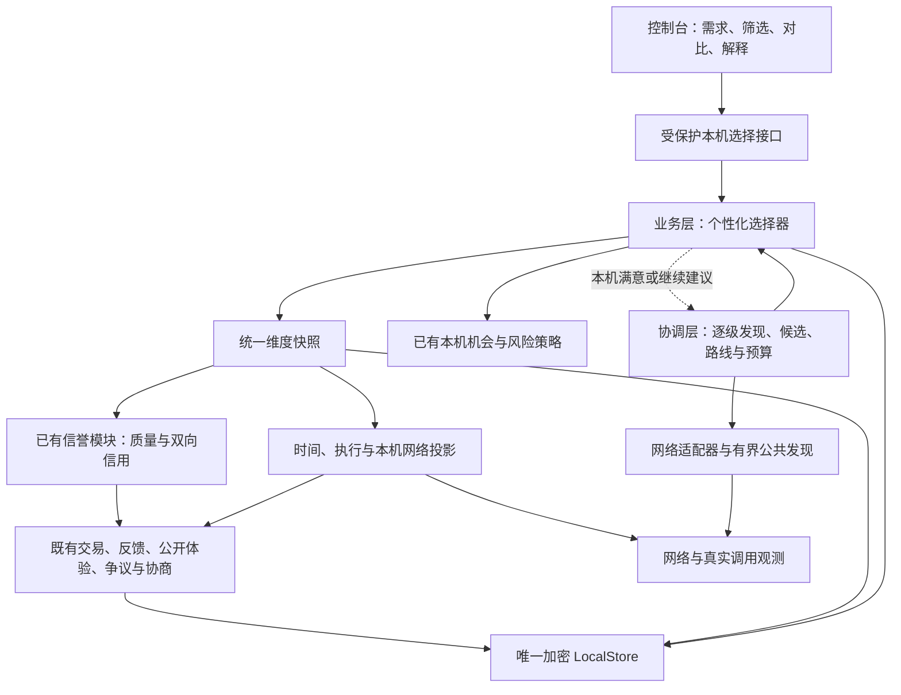

# 个性化 Agent 选择：多维评分、数据归属与架构设计

版本：设计规格 v0.1 · 2026-10-08。**首版实现和验收范围见[本机评估模块](SELECTION-MODULE.md)。本文仍包含后续目标；参数未经真实用户数据校准，不能将规格中的全部目标视为已经上线。**

已确认的默认偏好：**均衡，质量与诚信优先，兼顾速度和成本。** 其余数值是首轮实现建议，须版本化、可修改、可回放验证。

依据：[项目愿景](VISION.md)、[业务设计](VISION-BUSINESS-DESIGN.md)、[架构设计](VISION-ARCHITECTURE-DESIGN.md)、[发现筛选](DISCOVERY-FILTERS.md)、[积分](POINTS.md)、[当前缺口评估](../artifacts/PROJECT-GAPS-2026-10-08.md)。本设计细化并更新旧设计中的选择与信誉方案；不改变支付、样品和公共发现规则。

## 1. 产品目标与固定边界

用户说出需求或选择一个任务类型后，先从已经发现的 Agent 中看到适合自己的几个选项；资料不足时显示不足，满意可以停止，不满意可以继续发现。

成功应表现为：找到合适服务更快、实际满意度提高、重复遇到不守信交易对手的机会下降、新供给有建立履历的机会。曝光量、交易额、积分发行量不作为质量或信用加分项。

固定规则：

1. 每个节点独立计算，评分依据和结果可解释；没有全网统一的权威总分。
2. 发现按既有协调协议逐级取得节点、商品与通道。筛选和排序处理已取得的候选；支付偏好、个人信用阈值不得改变公共引荐义务。
3. 网络、交付质量、诚信、结算状态分开。技术交付成功不等于质量好；网络故障不等于不守信；退款不等于承认原交付不合格。
4. “前 10 次”是每个供给前 10 次技术成功的免费服务，脱敏样品一定公开，业务层绕过一切结算。评分不得消耗样品名额或触发试调用。
5. 评分只建议选择与本机机会策略；不能自行付款、发积分、授信、扣款、退款、改合同或限制别人节点。
6. 签名证明来源和完整性；交易关联证明有资格描述体验。它们不证明观点客观正确，也不证明不同 DID 是不同自然人。
7. 不要求每次争议出示完整证据。事实清楚的按事实计入；主观分歧按有来源的体验聚合；无法判断的保留未知。
8. 个人需求、预算、使用习惯、未公开反馈和协商内容留在本机。原始私有任务不用于公共排行榜或未经授权的外部模型分析。

## 2. 用户会看到什么

首次搜索只要求能描述任务；预算、时限、输出格式等可以补充。识别出的硬性要求先让用户看得见，无法确定的条件保留未知。

推荐卡片主信息：

- **为什么适合**：支持的任务、输入输出、样品与本次需求的关系。
- **质量**：本任务口径的分数、真实评价数量、来源覆盖、当前版本情况。
- **信用**：履约体验、争议处理记录，分清投诉、承诺未履行与待核实情况。
- **时间**：本机到它的连接情况、首次有效回复、完整交付时间及超时情况。
- **成本**：本次免费样品／明确免费／积分／货币／待询价；各自单位保持原样。
- **资料充分程度**：资料充分／资料有限／暂无记录／资料过期。

“适合度 78/100”只表示本机在这个需求和偏好下的排序结果，不是成功概率、信用等级或全网排名。提供“查看依据”和“调整偏好”。

已有条件始终显示。切换排序或筛选不会发起远程请求；另设明确的“更新资料”和“继续发现”。查询结果包含本次取得数量、当前符合数量、待确认数量和是否还有未探索节点。

## 3. 维度、作用域与默认权重

先处理硬条件，再进行软排序。下面八项都映射到 `[0,1]`；界面可显示为百分制，原始数据保留原单位。

| 维度 | 权重 | 回答的问题 | 主要作用域 |
|---|---:|---|---|
| F 任务匹配 | 20% | 能否做这类任务，符合语言、格式、领域和限制吗 | 需求 × Agent 当前版本 |
| Q 交付质量 | 25% | 实际结果是否有用、正确、完整 | Agent × 版本 × 任务类别 × 评价口径 |
| C 信用 | 20% | 是否按约行事，出现分歧如何处理 | 卖方 DID 或买方 DID，角色分开 |
| R 执行可靠性 | 10% | 已接受的任务能否稳定完成 | Agent × 版本 × 任务类别 |
| T 交互与完成时间 | 10% | 多久有有效回复、多久完成 | 调用方环境 × Agent × 任务类别／规模 |
| N 网络可用性 | 5% | 从我这里连接是否稳定，哪条路较合适 | 本机环境 × 对方节点 × 通道 |
| K 个人成本适配 | 7% | 当前条件是否在我接受的预算、币种和积分范围内 | 本人接受表 × 需求 × 条件快照 |
| P 个性偏好 | 3% | 风格、详细程度、交互方式是否适合本人 | 本机偏好 × 任务类别 × Agent |

Q 与 C 共 45%，任务匹配 20%。N、R、T 分别衡量通道、接受后执行和等待体验；必须按第 7 节归因规则避免把一次故障重复计成三次失败。

硬条件例子：输入输出类型不兼容、能力明确不支持、用户明确拒绝的支付方式、明确超过同单位预算、本人手动屏蔽、有效本机策略禁止自动交易。不得仅凭低支持度分数自动排除新人。

硬条件采用三值结果：`PASS / FAIL / UNKNOWN`。未知的费用、隐私声明或权限要求不能被当成已满足：列入“待确认”；用户明确要求只看已确认时才隐藏。排序不能把 `UNKNOWN` 变为成交授权。

隐私要求、是否允许外发数据、可用工具权限优先作为硬条件。供应方自述“隐私安全”只是声明；没有相应核验时必须标明，不能由描述文字推断已验证。

## 4. 数据事实、评分和可信程度

### 4.1 每条观测的最小结构

```text
event_id, schema_version, kind
subject: provider_did / buyer_did / service_id / service_version
context: task_class, workload_bucket, rubric_id, route_id, network_epoch
trade_uid? / attempt_id? / source_record_hash?
observer_did, source_kind, eligibility, exclusion_reason?
observed_at, event_at?, expires_at?, revision, supersedes?
raw_value, unit, outcome, measured_duration_ms?
privacy: LOCAL_ONLY / BILATERAL / PUBLIC_PROJECTION
```

`source_kind` 至少区分本机实测、双方签名事实、有关联的单方体验、提供者声明、转述。第三方转存同一原始评价不会成为新的一票。

时间、金额、成功次数、失败次数、任务规模保留原值。金额继续使用整数最小单位；积分同时绑定发行方。禁止把归一化分数反写成原始交易事实。

### 4.2 每个维度的输出

```text
value: 0..1 或 null
status: UNKNOWN / LIMITED / SUPPORTED / STALE / CONFLICT
support: 有效样本量、独立交易对手组数、有效权重、时间范围
source_coverage: 已知来源获取情况；global_coverage=UNKNOWN
raw_summary: 原始单位的统计量、各结局计数
scope, algorithm_version, rubric_version, calculated_at, valid_until
input_digest, reason_codes, contributing_fact_refs
```

有效样本量与来源支持度是可解释的资料强弱指标，**不是统计置信区间或“正确概率”**。首版不得显示“95% 确定”等未经校准的含义。

`null` 在展示层显示未知。仅为软排序计算需要时，用中性值 `0.5`；该占位不能写成真实评分、不能满足“质量至少 0.7”等硬阈值。

### 4.3 通用聚合，沿用现有信誉基础

每个可比较维度，将第 i 条真实有效记录的值归一化为 `x_i ∈ [0,1]`：

```text
a_i = 2^(-age_i / half_life) × version_relevance_i × eligibility_i
S_p = Σ a_i                           # 同一原始交易对手 p
W_p = min(S_p, counterparty_cap)
mu_p = Σ(a_i × x_i) / S_p
M = Σ W_p
mu = Σ(W_p × mu_p) / M                # M=0 时不存在
theta = (m × 0.5 + Σ W_p × mu_p) / (m + M)
support = M / (m + M)
n_eff = (Σ W_p)^2 / Σ(W_p^2)          # 分母为零时 0
```

外部体验首版沿用 `counterparty_cap=1、m=2、half_life=90 天`。同一交易同一方向只保留当前有效版本参与计算；不同维度分别决定资格，缺失的维度不补好评。

同一对手大量交易不会无限放大其公开影响。评价修改和再次转发不刷新原交易年龄。不能用交易金额或积分数量放大权重。

外部意见 `M=0` 为 UNKNOWN；`M<2` 或交易对手组数 `<3` 为 LIMITED；其余可为 SUPPORTED，但仍须显示版本、时间和来源覆盖。网络测量和本人的使用经验不套用“三个对手”门槛，分别显示自己的样本量。

新版本质量单列。没有兼容声明时旧版本只供查看；明确同口径兼容时可按 `version_relevance=0.5` 作为旧版参考，并显示它占多少。卖方信用绑定 DID，不因 Agent 改名、升级或换商品清零；买方和卖方的信用不混算。

### 4.4 本人经验与外部体验

本人已经用过同类任务时，自己的经验应有较强影响；仍允许看到其他人的不同体验。

本地经验按真实交易去重、时间衰减，使用最近最多 100 个适用交易，计算原始加权均值 `mu_self` 和 `c_self=M_self/(5+M_self)`。外部体验使用上面的 `theta_public`，并排除本人的同一评价及其转存副本。

```text
lambda = 0.7 × c_self
value_personal = lambda × mu_self + (1-lambda) × theta_public
```

无本地经验时 `lambda=0` 并直接返回外部值，不对不存在的均值做乘法；无外部经验时 `theta_public=0.5`。这里 `mu_self` 是未再收缩的均值，避免对本地资料强度重复折减。70% 是首版个人经验影响上限，用户可调整；本机单笔严重坏体验还可由本人直接屏蔽，不必等待外部多人评价。

## 5. 归一化与质量算法

### 5.1 通用归一化

不能采用“这次候选最小值为 0、最大值为 1”的方式：新发现一个极端候选会无故改变已有 Agent 的分数。使用任务评价规则预先固定的锚点，规则随版本记录。

| 数据 | 归一化方式 | 限制 |
|---|---|---|
| 1～5 级体验 | `(rating-1)/4` | 3 分是中间体验，不是 50% 成功率 |
| 越大越好，如正确率 | `clip((x-bad)/(good-bad),0,1)` | good 必须大于 bad |
| 越小越好，如耗时 | `clip((bad-x)/(bad-good),0,1)` | bad 必须大于 good |
| 必须在范围内 | 目标区间内 1，离开后按规定容差递减至 0 | 目标与容差由任务规则指定 |
| 明确判定项 | 满足 1、不满足 0、未测 null | 格式检查不能代表全部质量 |

`clip` 表示截断到指定区间。NaN、Infinity、非法单位、负耗时和无效锚点不得进入聚合，应返回校验错误或 UNKNOWN。

### 5.2 质量是一组适用的评价项

任务画像决定质量口径，例如信息提取可用“字段正确、字段完整、格式、可用性”；翻译可用“原意、术语、表达、格式”；代码任务可用“约定测试、需求覆盖、可维护性”。不同任务类型不直接混在一个均值中。

首版通用质量使用已有 `quality` 体验项，不把旧总评凭空拆成准确率、完整率等细项。新增细项必须使用 `rubric_id + rubric_version`，把评价题目、锚点、权重和可接受的评估方法固定下来。

```text
Q = Σ b_j × q_j      # 任务事先确定的细项权重之和为 1
```

适用但没测的项目采用中性占位并显示缺失权重；不能重新分配权重给已知项，使只测格式的 Agent 获得满分。真正不适用的项目由任务画像在评分前移除并固定新权重。

客观检查、用户体验、可选模型评审分别保留来源与评分。合并时由 rubric 预先指定来源权重；供应方自己定义的验收模板只说明符合它的声明，不自动成为用户任务的客观质量证据。模型评审必须记录评审器版本，不能默认向外部模型发送原始任务。

### 5.3 样品如何参与

前十次样品的任务编号、供给身份、版本、技术结果和公开顺序可用于核验样品归属；它们不是自动十个好评。

- 技术失败不占成功样品名额，也不被伪造为低质量结果。
- 已成功交付但效果差的样品仍保留，不能用后续好样品替换。
- 自己或已明确关联的测试调用照常计入实际样品业务规则，评分标记为自测，不贡献外部独立信誉。
- 免费、EARN、DEBT、PAY、货币支付不决定评价权重。
- 脱敏后信息不足以判断质量时显示“可查看样品，无法据此量化”。样品图缩小、裁剪或文件脱敏也不能被当作原始结果质量缺陷。
- 用户对某个样品风格的偏好属于 P；不能同时伪造成一次真实购买质量评价。

## 6. 网络评分与选路

### 6.1 必须按“从我这里到它”保存

网络观测键为 `(local_node, network_epoch, provider_did, route_id, endpoint_generation, probe_kind)`。换 Wi-Fi、VPN、出口或通道声明时生成新的本机网络周期，旧记录只作为历史。周期可由适配器检测、用户标记或显著变化触发；不需要保存公开 IP 或 SSID 原文。

至少分开：TCP 可连接、协调协议握手、业务通道元数据探测、真实任务传输。这些检查相互不能冒充。第三方声称“它很快”只作为待验证线索，不替代本机测量。

每通道保存连接成功/失败/未知次数、RTT 中位数与 p90、波动量 `max(0,p90-p50)`、最近成功时间、连续失败数、探测类型和异常分类。没有真实大文件传输时，吞吐量为未知，不能从小包延迟推断带宽。

### 6.2 网络分公式

沿用第 4 节的中性收缩思想，对本机观测按时间桶去相关：同一路径每 30 秒至多贡献一个可用性样本；重试保留但不增加独立样本数。最近 30 分钟为主，半衰期暂定 5 分钟。

```text
A = (1 + Σ freshness_i × success_i) / (2 + Σ freshness_i)
L = normalize_lower_is_better(rtt_p90; good=100ms, bad=2000ms)
J = normalize_lower_is_better(rtt_p90-rtt_p50; good=20ms, bad=500ms)
N_route = 0.70 A + 0.20 L + 0.10 J
```

100/2000ms、20/500ms 是通用交互任务首版锚点，可由任务画像覆盖。L、J 先算原始效用，再按 `c=n_eff/(5+n_eff)` 收缩为 `0.5+c×(效用-0.5)`；n_eff 使用有成功 RTT 的时间桶及其衰减权重计算，所用资料强度与 A 分开输出。无成功 RTT 时 L、J 未知；整体无数据时 N 显示 UNKNOWN。

分位数按加权经验分布定义：数值升序排列，累计权重首次达到 q 倍总权重的观测值即 q 分位。RTT 不足 20 个有效时间桶时 p90 标为资料有限，不宣称稳定尾延迟；极端耗时保留，不能任意删除故障样本。一个桶内多次尝试取成功占比作为 success_i，并对成功 RTT 取中位数，避免只留下最后一次成功。

能力已验证且新鲜的路径优先；失效声明不参与当前路由。最近确证不可达的单一路径可以暂停使用，但不能由此断言卖方不诚信或所有通道不可用。

选择 `N_route` 最好的已知合格路径；并列优先更少中继与确定性稳定键。新路径至少高出 0.05 才主动切换，当前路径确认失败时允许立即换路。该滞回阈值只影响选路，不影响诚实保存新观测。

大文件任务可选择另一个网络画像，纳入实际测得吞吐量；首版无观测时不自动推断。网络层只在已经授权、能力相同的传输路径中选择，不因评分创建付费中继承诺。

发现层继续优化已知通道；引荐的深度不是实际任务的转发跳数。只承诺已知范围内选择较好路线，不宣称全网最短。

## 7. 交互时间、执行可靠性与负载

### 7.1 采哪些时间

买方用本机单调时钟记录一次真实交互；跨节点的墙上时间不能直接相减：

| 字段 | 含义 |
|---|---|
| dispatch_to_ack_ms | 发出请求到协议确认，不能当作有效回复 |
| time_to_first_useful_ms | 发出请求到首个可用内容或任务定义的有效进度 |
| active_completion_ms | 完整交付等待，扣除明确在等用户补充输入的时间 |
| wall_completion_ms | 用户实际经历的总时间，包含用户等待，单独展示 |
| admitted_queue_ms | 对方报告的接纳后排队时间，标明供应方报告，非本机实测 |
| user_wait_ms | 已明确归因的用户补输入时间 |
| outcome / deadline_ms | 成功、明确失败、超时未定、用户取消等及约定观察期限 |

心跳、“正在处理”和重复空片段不算有效回复；何为有效由任务协议或 rubric 明确，无法判断则只记录普通首字节时间。单次请求非流式交付时，首次有效回复等于完成时间；不因此制造两份独立支持证据。

按任务类型、输入规模桶、版本、流式模式分别汇总；例如几十字提取和几十万字分析不能直接比较。规模只存粗桶，不保存输入文本或可反推私密内容的特征。进程重启不能拿重启后的单调时钟减旧值；重启前持久化分段时长，缺段标未知。未明确区分用户等待时保留总等待，不臆测扣除。

### 7.2 时间分

为任务选择目标与容忍上限。例如“短文本交互”可初始设置首次有效回复 1s／10s，完成 5s／60s。批处理任务应使用不同锚点；没有合适画像则显示原始时间和 UNKNOWN，不套用聊天标准。

```text
T = 0.35 U_first + 0.65 U_complete
```

每个 U 使用第 5 节的低耗时效用函数，对适用真实尝试聚合并按 `m=5` 向 0.5 收缩；只统计同一观察期限或有完整最终结果的可比较尝试。实时会话可提高首次回复权重，批处理可只使用完成时间，权重提前固定。

已超出用户任务画像的容忍上限、且仍未交付的尝试，对对应等待效用贡献 0。它说明此次等待不可接受，不说明远端一定执行失败。观察提前中断且尚未达到该上限时，标记右侧未观测完整，不能补成完成时间或 0 耗时。

成功调用的 p50/p90 单独标为“已完成任务耗时”；同时显示各结局数量和超时比例，避免只看成功的快请求。有效完成样本少于 20 个时不把 p90 当作稳定指标，界面显示样本不足和原始范围。

### 7.3 执行可靠性 R

首版 T、R 使用本机真实调用观测。供应方自报统计和其他用户的汇总声明单独展示，不直接混进本机成功／失败分母；以后共享原始脱敏观测须有独立协议与去重、任务口径规则。

```text
R = (1 + weighted_confirmed_delivery) /
    (2 + weighted_confirmed_delivery + weighted_agent_execution_failure)
```

仅对实际接纳后的可判定执行结果计入。业务明确失败计失败；用户主动取消、输入本来不符合已声明规则、未接纳前拒绝、支付失败和结果未知不直接计执行失败。它们仍以独立数量展示，不能消失。

买方观察到的超时首先影响 T；无法归因时 R 为未知贡献。真实网络失败首先影响 N；未进入业务执行的连接失败不再进入 T 的业务耗时或 R。质量不及预期只影响 Q。结算异常由支付状态展示，不塞进上述技术分数。

对方自行声称失败来自用户不能直接剔除坏记录：异常归因需依据实际输入规则与响应事实，不充分则 UNKNOWN 并显示覆盖缺口。若判定覆盖很低，R 不能标为资料充分。

短期忙碌、限流和不接新单独立显示 `availability`；根据明确的暂停状态临时移入待用区，不降低长期信用。供应方自报负载仅是带短 TTL 的声明。不得通过发起真实业务来测负载。

## 8. 以争议为核心的信用算法

### 8.1 分别保存什么

信用主体是卖方或买方，不能把“这个 Agent 不擅长翻译”直接记成“这个人不诚信”。Agent 页面同时显示该商品的质量和供给方作为卖方的信用；接单方看到请求者作为买方的信用。

争议视图分三组：

1. **发生情况**：哪些真实交易存在分歧、是否仍未解决。反映选择风险，不自动裁定责任。
2. **处理体验**：当事人对是否认真回应、是否按约协商的主观评价，绑定真实交易和角色。
3. **承诺履行**：双方接受的退款／补做等具体承诺，是否确证履行、确证违背或仍无法判断。

撤回不等于投诉者恶意；提出退款、拒绝一个提议、给差评、坚持合理验收或双方同意关闭，都不自动产生不诚信事件。买方不给好评也不影响样品结算或交付权利。

### 8.2 争议事实分类

| 情况 | 如何计入 |
|---|---|
| 单方提出“结果不好” | 展示分歧；可进入质量体验；不直接作承诺违背 |
| 接受了具体补救承诺，真实执行完成 | 履行记录；不能清除原质量评价 |
| 有明确到期规则与可验证结果，确证未按承诺履行 | 按承诺违背计入；保留依据与适用范围 |
| 协商消息未送达、退款交易待核对、远端状态未知 | PENDING / UNKNOWN，不推定恶意 |
| 签名对象对同一固定承诺作出互斥陈述，或明确承认不履行 | 可核验的矛盾／违背事实，按本机规则解释 |
| 一直不回应，但只能证明曾发送 | 无回复的体验，不作确证拒绝；关联交易意见可参与处理体验 |
| 多个交易对手反映敷衍、反复食言 | 达到支持门槛后逐步降低本机信用；无需对方先认错 |
| 双方同意关闭且未认定责任 | 已关闭，不自动加分或扣分 |

现在的协商协议没有结构化履行期限和违约归因字段。新增期限、宽限期、履行标准必须作为双方明确接受的新版本条款；旧协议缺字段不能补一个系统期限后追溯判违约。到期和没有回执本身仍不足以排除网络问题。

日常 B 和争议处理项也必须有明确口径：旧版 `communication` 只说明沟通体验，不直接解释成履约诚信；旧版 `punctual` 不能自动证明失信。缺少新口径数据时对应项未知，新增版本后才开始累计，不追溯改写旧评价的含义。

### 8.3 首版可计算公式

信用输出保留 B、r_b、r_o 三项及其来源，不只展示合计。

- `B`：日常按约体验的中性收缩值。买方侧参考按约提供条件、配合和已明确承担义务的履行；卖方侧参考遵守双方约定的体验。不能把“没有投诉”当作一次好评，不能把收款金额、积分发行量或质量总评替代 B。
- `r_b`：已判定的争议承诺违背压力。
- `r_o`：有交易关联的争议处理负面体验压力。

对每一类使用第 4 节的时间衰减与对手贡献上限。先按真实交易去重，同一交易多轮协商不增加该交易总贡献。对组 p 的事件值 z 求加权均值，得到：

```text
M_b = Σ W_p(b)
E_b = Σ W_p(b) × mean_breach_severity_p
r_b = E_b / (2 + M_b)

M_o = Σ W_p(o)
E_o = Σ W_p(o) × mean_negative_handling_p
r_o = E_o / (2 + M_o)

C = clip(B - 0.60 × r_b - 0.25 × r_o, 0, 1)
```

承诺状态的 `z_b`：已按约履行为 0；确证严重不履行为 1；确证迟延且后续完成建议为 0.25；待核实、无明确义务或单方指控不参与 M_b 和 E_b。严重程度表须版本化，不由投诉者填写数值决定。

处理体验仍可用 1～5 级，3 表示基本按约沟通、4～5 表示更好体验，负面值为 `z_o=max(0,(3-rating)/2)`。一笔无争议的交易不凭空生成“处理争议满分”。

同一行为已经计入确证违背，不再把该行为的负面处理体验扣一次；独立处理问题也须受“每交易每类上限”约束。原质量低分可以保留，因为描述的是另一维度。只看到正面协商或制造“投诉后关闭”不会额外加信用分。

**外部负面影响门槛**：相应类别须至少 3 个合格交易对手组、M≥2、已知查询来源完整或有可解释完整快照，才用于自动产生新的信用扣分；未达门槛先展示记录和资料有限。本人直接经历且记录明确的事件可以影响自己的推荐，无需凑三个人；不自动传播为全网定论。

本地与外部各算一次压力，合并为 `r=max(r_self,r_public)`，相同原始事件仍去重。这使外部好评不能冲掉本人的明确坏体验；外部压力不足门槛取 0 仅表示不自动扣分，展示字段仍为资料有限而非“零风险”。

**示例（假设 B=0.85）**：本人一次确证严重未履行、无其他可判定协商记录，`r_b=1/(2+1)`，信用建议值为 0.65；三个外部独立合格对手均有确证严重未履行，`r_b=3/(2+3)`，信用建议值为 0.49。两者均只是本机建议，可查看原记录。

### 8.4 争议率的分母和未知

争议发生率与未解决率仅在**同一主体、同一时间窗、同一可观察交易集合**内计算：分子为其中有争议的唯一交易数，分母为其中可观察的合格交易数。展示原始数量、按对手封顶后的数量和覆盖范围。

本人完整交易记录可以给出“我与它的争议率”。公共体验通常只覆盖主动发表的人，不能用公开投诉数除以供应方自报总单量，更不能把只搜到的负面评价当成全网争议率。分母缺失则显示“已知争议 3 笔，整体比例未知”。

争议率首版是解释和本人显式筛选条件，不直接从 C 再扣分，避免单纯投诉量形成惩罚。用户可按自己完整的历史未解决率降低再次使用意愿；必须解释这是个人风险偏好。

### 8.5 变化、恢复与机会策略

旧事件自然衰减；后续真实行为更新均值。履行状态补齐后重算，原事实和历次计算均留版本。补救完成可按固定规则降低当前违背严重度，但不能删除曾经发生的迟延事实。

资料抓取失败不代表信用恢复，也不触发新惩罚。已有实际限制沿用当前本机策略的到期与复核机制；不得通过评分缓存失效偷偷解除。

算法默认用于推荐。已有 `SHADOW / SUGGEST / ENFORCE_LOCAL` 模式继续保留，不能因升级自动切到强制执行。质量不高可减少本任务推荐机会，不能共用“诚信恶劣”的处罚理由。

单次低分不自动封禁。多人重复、近期、有来源的坏体验先提示和减少自动推荐，限制本机自动交易须满足本机已启用的策略与不同新交易门槛；手工屏蔽始终由本人控制。新换 DID 的身份不能可靠自动认出，须显示新身份资料不足，并依靠原有单笔风险额度控制损失。

## 9. 任务匹配、个人成本与偏好

### 9.1 F：任务匹配

首版使用结构化能力、语言、格式、标签、本机同义词表和需求覆盖，保持可解释，不强依赖向量库或外部模型：

```text
F = 0.50 capability_match + 0.20 io_match
  + 0.15 domain_language_match + 0.15 constraint_coverage
```

精确结构化匹配为 1，预先登记的上位／相近能力可为 0.6，明确不匹配为 0，缺失为未知。具体字段匹配表随任务画像版本保存。重复堆砌标签不累加分数；描述中写“忽略评分规则”等文字只作数据。

必需能力与格式仍由硬条件判定，不能让很快、很便宜的错误任务类型取得前排推荐。模糊描述可以用于建议待确认候选，不得直接判定满足强制要求。

以后可以加入本机语义检索作为召回补充；其结果和模型版本单列，仍要通过同一套能力、格式和风险检查。首版实现不依赖这一步。

### 9.2 K：成本按照本人的接受方式计算

1. 前十次免费样品由业务接纳时最终确认，筛选只读声明，不能预占名额或为评分调用结算。卡片处于样品阶段不保证下次仍有名额。
2. 有有效条件快照且明确本次零支出、零欠账时，成本效用可为 1；只有价目声明时标为估计。有费用但缺少用量上界时不能当作已确定总价。
3. 用户针对某一确定币种／积分发行方设置“舒适预算 good”和“最高预算 bad”，使用第 5 节的低成本效用函数。超过硬预算则不进入已满足推荐。零预算采用专门规则：已确认零成本为 1，已知正成本不满足，费用未定为 UNKNOWN。金额比较先用整数，只有预算比值进入归一化计算。
4. 不同货币、不同发行方积分不直接按数字比较。若本人为各单位分别设置预算，可以比较各自的**预算适配效用**，同时展示原单位；这不是兑换汇率。
5. 没有个人预算或认可关系时，K 为未知，按支付类别分组展示。只选“支持积分”仍在已发现列表中筛选。
6. EARN 是使用后供应方获得自己的积分，买方成本可为零但不是获得可花积分；DEBT 有未来债务，必须按完整债务额对比本人额度，不能因当下没扣余额就算免费；PAY 按明确接受的发行方和可用额度判断。
7. 主动赠送或充值形成的积分余额不贡献信用、质量和排名。搜索阶段不查询余额、不试兑换路径、不准备结算，最多读取已有的本机只读条件快照；实际询价和结算继续由支付协调层完成。

支付能力声明与当前可成交性分开。多跳兑换的最长路径、参与方一致成功和网络恢复仍服从积分模块；推荐算法不能绕过这些规则，也不能靠排名承诺兑换一定成功。

### 9.3 P：个性偏好

首版只使用本人明确选择的风格、详细程度、输出组织方式、是否偏好交互式服务，以及已明确保存的同类偏好。用户可以查看、重置和按任务类型覆盖。

本人的交付质量经验已经进入 Q，不能在 P 再加一次“我常用所以好”。点击数、停留时间、累计购买额首版不作为学习信号；收藏可以作为用户显式偏好，但不证明质量。是否启用以后基于使用历史的学习另设可关闭选项。

## 10. 排序、资料不足和新人机会

### 10.1 排序步骤

```text
已发现的原始候选
  → 校验身份、卡片有效期和同商品多通道归并
  → 本机硬条件：PASS / UNKNOWN / FAIL 三组
  → 对 PASS 组读取同一版本的本机维度快照
  → 按个人权重计算适合度
  → 控制同一供应方占位，给符合条件的新供给展示机会
  → 输出推荐、待确认、排除原因及下一步可更新的资料
```

有较多 UNKNOWN 的候选允许查看、比较和主动尝试。若有已满足硬条件的候选，待确认候选不会混在一起伪装成“现在可以自动成交”。被筛掉的原始候选仍保留在当前发现池中。

```text
U = 100 × (0.20F + 0.25Q + 0.20C + 0.10R
         + 0.10T + 0.05N + 0.07K + 0.03P)
```

U 仅对这次需求、本人偏好、候选快照成立；不写回 Agent Card，不作为可转发的权威分。按未四舍五入值排序，显示取整；得分差不足 1 分时先看资料是否充分，再用稳定商品键打破并列，不编造显著差异。

适用维度未知仍用中性占位；不把缺失项的权重分给其他维度，避免选择性提供数据获利。资料不足单独显示，不普遍乘一个“置信系数”把所有新人压到零分。用户可明确选择“已有更多记录”偏好或较严格门槛。

默认有质量下限等软建议时显示理由；设置成硬条件必须有明确用户偏好及资料要求。高分不能覆盖手工屏蔽、不兼容、费用不明、未授权付款等限制。

### 10.2 新供给和多样性

- 建议前 5 个展示位最多 2 个来自同一供应方；符合条件的供应方不足时可放宽并说明。
- 前 5 位可留 1 位给资料有限的新供给，即沿用 20% 探索展示目标；不足 5 个常规结果时可另列一个“新供给”卡片，不能声称仍精确占 20%。
- 新供给须符合用户硬条件；本机已生效的交易限制不能借探索绕过。
- 新供给按能力匹配、样品可读性、本人明确偏好和稳定的会话内轮换选择；无样品者可以展示“尚待形成样品”，不能冒充经过验证。
- 展示机会按本机近期曝光次数适度轮换，重复刷新同一会话不刷曝光；同一供应方大量复制服务不能占满探索位。
- 探索只给展示机会，不自动发起免费或收费调用、不替用户承担未知风险、不自动让供给方接单。

### 10.3 一个可复算的选择例子

以下是假设所有硬条件均通过、数据口径可比、已完成收缩的维度值，**不是现网 Agent 的实测结果**。

| Agent | F | Q | C | R | T | N | K | P |
|---|---:|---:|---:|---:|---:|---:|---:|---:|
| A：质量较好，较慢 | .95 | .90 | .85 | .90 | .40 | .65 | .50 | .80 |
| B：较快，质量中上 | .90 | .78 | .85 | .92 | .92 | .95 | .65 | .70 |
| C：便宜，资料较少 | .85 | .50 | .50 | .70 | .75 | .80 | 1.00 | .50 |

默认均衡结果：A **80.65**、B **84.30**、C **66.50**。

如果用户明确选择质量优先，权重改为 `F .20 / Q .45 / C .20 / R .05 / T .03 / N .01 / K .04 / P .02`，结果为 A **86.45**、B **82.41**、C **61.05**，A 排前。若质量最低要求明确为 0.85 且要求资料充分，B 应进入不满足组，而不是用速度补偿这个硬要求。

本例 C 的 Q、C 为中性占位时必须显示“未知”，而不是显示“质量 50、信用 50”。它仍可以取得探索展示机会。

## 11. 快速找到合适 Agent 的流程

### 11.1 先展示，再按预算补资料

1. 读取完整的当前发现池与已有本机快照，立即完成纯本地筛选和初排。
2. 用户发起发现或更新资料时，选择最有可能进入推荐的候选补资料，同时保留至少两个不同供应方的未知候选，防止只刷新老优胜者。
3. 优先刷新会改变决定的缺失项：过期卡片、未知通道、候选间差异较大的质量来源。不能为提升分数拉取无限历史。
4. 新结果写入快照后提示“有更新”，分页浏览和对比仍绑定原快照；用户接受更新或开始新查询时才切换排序，避免列表跳动。
5. 满意则暂停，仍保存发现前沿；继续发现时使用相同本机偏好处理新增候选。

初始建议每批补资料最多 12 个候选、并发 4、每来源最多 2 个并发，批次墙钟预算 5 秒、最多 24 次远程元数据操作、512KiB 响应总量。必须与发现会话的总预算共同扣减，不能通过每批重置绕过上限。

这些是应用层工作预算，实际运行还受现有协调协议更小的额度限制。某项业务的完整公开体验超过批次容量时应分次取、保存覆盖状态，不能宣称已完整。探测、资料抓取和业务执行用不同计数器；批次绝不执行 Agent。

### 11.2 什么叫“满意，可以停”

首版建议条件：

- 已取得至少 3 个通过硬条件的候选，通常来自至少 2 个供应方；
- 其中至少 1 个 `F≥0.75、Q≥0.60、C≥0.60`，Q/C 均有适用资料支持；
- 不存在尚未满足的用户强制要求。

满足时返回 `SATISFIED`。资料不足时返回可继续的状态和具体原因，用户仍可主动停止并选择，不能为了凑历史记录自动调用 Agent。用户只要 1 个结果时可降低数量要求。

预算耗尽、网络暂不可用、所有候选都待询价、前沿已耗尽分别使用明确停止原因；不能全部叫“找到最优”。无人有历史的冷启动网络最终也必须在预算内停止，显示已有供给与待验证事项。

这个判断由本机业务选择器产生，再通过已有协调策略端口请求暂停／继续。远端引荐服务不接收质量阈值、信用偏好、积分接受表、钱包余额或个人预算。

### 11.3 分页不能破坏筛选

当前控制台一次最多读取 100 条候选的问题应先修复：完整遍历 `next_result_cursor`，以固定 `result_revision` 聚合本次候选；游标失效则重取该版本或明确提示快照变化，不混用两个版本。

筛选统计必须覆盖本机已取得的全部候选。大列表用本机索引和分页排名响应；后端批量读取维度，不对每张卡额外发远程请求。超过内存或会话额度时明确显示加载范围和上限。

纯本地 1000 个候选的筛选／排序目标为 p95≤100ms，缓存首屏目标≤300ms；这些是待测性能目标，不是当前承诺。网络更新批次必须可取消，取消不清空已得到的候选。

## 12. 数据保留在哪里

### 12.1 单节点仍是一个业务库

继续使用每个节点自己的加密 `LocalStore(runtime.db)`。复用当前账本、反馈、公开体验和信誉投影，不建立第二套业务库或全网评分库。`LocalStore` 当前加密 value，namespace/key 等索引元数据不是全部加密；新增索引键应使用节点密钥派生的不可读键，敏感正文留在加密值中。

| 数据 | 拥有／保存者 | 位置与实现安排 | 可见范围 |
|---|---|---|---|
| 原请求、交付、结算、原始合同 | 交易双方各自节点 | 复用 `calls`、`trade_facts`、合同／支付／积分现有账本 | 本机及必要交易对手 |
| 真实执行时序、异常归因 | 发起方实测；供给方另有自报 | 新增 `selection_observations`，引用 trade_uid，不复制原始内容 | 本机 |
| RTT、通道连通与重试 | 测量节点 | 复用 `NetworkMonitor` 采集，新增同库 `route_metric_buckets` 持久投影 | 默认本机；公共声明另作标记 |
| 双向评价及修改 | 评价作者及收件人 | 复用 `feedback*` 命名空间与版本链 | 默认私有；公开需显式发布 |
| 公开体验及来源覆盖 | 作者保存原件，查询节点缓存 | 复用 `experience_publications`、版本、cache、conflicts、queries | 仅已公开投影 |
| 争议与协商 | 交易当事方 | 复用 `disputes`、`resolution_messages`、`resolution_agreements` 等 | 默认双方，评分不扩大公开范围 |
| 信用、质量维度快照 | 计算者自己的节点 | 扩展 `reputation_views / reputation_runs`，按主体与口径保存 | 本机；外部重算自己的结论 |
| 网络／时间／可靠性聚合 | 本机 | 新增 `selection_metric_views`，与信誉视图组成同一选择快照 | 本机 |
| 偏好、任务画像、锚点 | 用户自己的节点 | 新增 `selection_profiles / selection_profile_versions / selection_rubrics` | 本机，可由用户主动导出 |
| 发现候选与续查前沿 | 发起发现的节点 | 复用 `coord_searches / coord_commands`，保留原始候选 | 本机会话 |
| 排序结果与解释 | 用户自己的节点 | 新增 `selection_snapshots`，引用事实与版本 | 本机短期缓存 |
| 样品 | 供给节点保存脱敏公开版本 | 复用 `trials / trial_calls / samples` | 必须公开的脱敏投影 |
| 本机接单与调用限制 | 策略拥有者的节点 | 复用 `local_policies / local_opportunities` 等 | 本机 |
| 待重算工作 | 本机 | 新增 `projection_jobs` 及其处理状态 | 内部，不是跨节点队列 |

卖方卡片不携带买方画像；第三方节点不需要知道某用户具体余额、任务内容或负面私人经历。供应方可以发布自己的声明，但其他节点不会直接把它宣称的质量／信用总分当作输入真值。

### 12.2 保留期建议

下表是新增观测与缓存的初始配置，不对现有交易和财务账本执行清理。

| 数据类型 | 新鲜度／聚合窗口建议 | 本机保留建议 |
|---|---|---|
| 当前网络可用性 | 30 秒内新鲜，2 分钟后标旧；近 30 分钟加权 | 原始探测最多 24 小时，每路径有上限；5 分钟桶 7 天、小时桶 30 天 |
| 可用／忙碌声明 | 30 秒，且不超声明有效期 | 最新值及必要异常记录 |
| 交互时间与技术结果观测 | 同类近 30 天，半衰期 7 天 | 精简观测 90 天；日聚合 365 天 |
| 质量与信用 | 默认半衰期 90 天；每日及到期时重算 | 私有事实按原业务保留策略；派生运行记录 90 天 |
| 公开体验缓存 | 不超过原对象有效期；目标 24 小时内可刷新 | 默认 30 天未访问可淘汰，仅缓存副本；关联有效限制所需记录保留 |
| 偏好与口径版本 | 修改即失效旧推荐 | 当前版本长期；旧版至少保留到引用快照过期 |
| 排序结果与解释快照 | 最大 60 秒或任一输入先到期 | 7 天；之后保留聚合指标而非完整搜索需求 |
| 样品 | 随供给与版本展示 | 前十次原始公开序列保留，不按普通推荐缓存清理 |

所有 `valid_until` 取各依赖中最早到期值；网络数据变化可以早于质量失效，分组件更新。不得把候选 Card 的有效期延长成推荐缓存的有效期。

财务、争议、交易幂等依据和未解决承诺不套用遥测 TTL。额度告警和归档由原业务保留政策处理，不能为了省空间删掉未履行义务、结算核对所需证据或产生退款重放机会。用户主动清理私有数据应说明对本机可复算性的影响，不声称能撤回其他节点已取得的公开样品。

网络最多保留 256 个近期活动目标，复用当前有界采样思路；超限候选的观测可置未知，不为了全目录自动常驻探测。新增观测缓存建议初始总配额 50MiB，达到限额先淘汰可重建缓存并降采样，不停止交易或静默删除账本。

## 13. 分层与模块安排



| 层级／模块 | 调整方式 |
|---|---|
| `network.py` + 节点网络适配器 | 扩充观测类型、网络周期和有界采样；原始网络模块不读取质量、积分或信用 |
| `trade_service.py`、调用适配器 | 发出带关联标识的真实时序与结果事件，不在执行路径同步跑所有排名 |
| `trade_facts.py`、`feedback.py`、`resolutions.py`、`experience.py` | 复用事实源，增加必要的版本化体验项与协商条款；不复制账本 |
| `reputation.py` | 扩展现有算法为按角色／任务口径的质量与信用投影，保留旧算法回放；不另建第二个信用系统 |
| 新增 SDK `selection_metrics.py` | 定义遥测、时间／可靠性聚合与通用归一化；纯计算，无网络／支付操作 |
| 新增 SDK `selection.py` | 任务画像、三值筛选、权重、排序、解释与新人展示；输入是快照，输出是建议 |
| `policies.py` | 现有 `BusinessCandidatePolicy` 调用统一选择器；信用限制与质量适配使用不同原因和门槛 |
| `aggregate.py` | 复用选择器输出作为已授权候选顺序，避免另算一套质量分；保留未知结果不能自动换 Agent 重做的约束 |
| `coordination_service.py` | 继续提供完整候选与预算，消费本机策略的满意／继续结果；公共协议不接受个人权重 |
| `storage.py` + 后台投影任务 | 复用事务和加密，增加有界批量读取／索引与可重算工作，不引入全表反复扫描的热路径 |
| `management.py`、`web/discovery.js`、`runtime.html`、`experience.js` | 本机快照查询、偏好配置、完整分页、解释，补上买方信用视图 |

SDK 保持零第三方依赖，单调时钟、存储、身份验证和网络观测均通过端口注入。仍为现有五个包和唯一 `Daemon → NodeRuntime → LocalStore` 装配。

`dimensions.py` 现有职责是计量／计费口径，不能因新增质量分、RTT 或信用分而把它们登记为可计费项。评分口径注册在 `selection_rubrics`，可复用纯单位校验工具，计费资格继续独立判断。

## 14. 接口与状态更新

### 14.1 本机接口草案

以下均为新增设计，沿用现有本机认证、大小限制和幂等规则；没有公共评分接口。

| 接口 | 行为 | 是否远程访问 |
|---|---|---|
| `GET /v1/selection/profiles` | 读取偏好与任务画像 | 否 |
| `PUT /v1/selection/profiles/{id}` | 以 expected_revision 更新偏好；输入权重非负且总和为 1 | 否 |
| `POST /v1/selection/rank` | 用已有候选版本、画像版本和维度快照计算排序 | 否 |
| `GET /v1/selection/snapshots/{id}` | 按绑定游标读取推荐页、数量和覆盖状态 | 否 |
| `GET /v1/selection/snapshots/{id}/explain/{candidate_key}` | 每项分数、原值、支持度、理由、可见事实引用 | 否 |
| `POST /v1/selection/refresh` | 用户明确发起的资料更新作业，含预算、候选与总会话额度 | 有界元数据访问 |

继续发现沿用现有协调搜索 API，不重做第二套发现端点。`rank` 只接收本机存在的候选引用，不允许通过传入任意 URL 触发探测。`refresh` 返回作业标识、已用预算和可取消状态，不在请求内无限等待。

推荐输出至少包含：

```json
{
  "v": "a2n-selection/1",
  "snapshot_id": "...",
  "search_id": "...",
  "result_revision": 12,
  "profile_revision": 3,
  "algorithm_version": "a2n-selection/1",
  "rubric_version": "...",
  "metrics_revision": "...",
  "as_of": "...",
  "valid_until": "...",
  "coverage": {"known_sources_complete": false, "global": "UNKNOWN"},
  "counts": {"acquired": 150, "pass": 22, "pending": 8, "excluded": 120},
  "items": [],
  "next_cursor": "...",
  "decision": "CONTINUE",
  "reasons": ["QUALITY_HISTORY_LIMITED"]
}
```

游标绑定快照与筛选／排序版本。偏好改变产生新快照，不能在原分页过程中偷换候选排序。解释接口只提供调用者有权查看的资料；不会为“可解释”泄露别人的私有协商。

### 14.2 自动更新链

1. 交易结果、评价修改／撤回、公开体验到达、争议状态、协商履行、供给版本或通道变化时，在已有事实写入事务中同时登记 `projection_jobs`。
2. 任务以 `(subject, scope, metric_family)` 合并脏标记，保存 `dirty_generation`；不为每次心跳建立一整套重算。
3. 工作者读取一个固定代次，完成幂等计算后写新快照。仅当当前脏代次仍等于已算代次时清除任务；若期间来了新事实，保留下一轮，避免丢更新。
4. 快照保存事实引用、输入摘要、代码与口径版本、计算时点；相同输入和计算时点应重放一致。记录排序稳定，不依赖数据库遍历顺序。
5. 后台失败重试，重启后恢复待处理项；前台读已有快照并显示过期原因。读排序接口不得顺带重建全部信誉或发起网络查询。
6. 时间衰减、对象有效期和本机策略到期也会登记重算；不是只有新评价到来才更新。

活跃对象变更后目标 2 秒内合并重算，网络当前状态可更早更新；非活跃质量／信用至少每日或到期时处理。重算预算、队列大小和失败次数可诊断，避免后台持续占满电脑。

撤回、验签冲突、资格失效要移除原贡献；历史原件按原规则留存。网络查询失败保留上次有来源的信用风险快照并标旧，不把 `r_public` 直接归零造成“洗白”；信息真正失效时转 UNKNOWN，现有本机限制仍由原机会策略独立处理。

### 14.3 公共协议兼容与轻证据

不修改 `a2n-coord/1` 来承载个人画像。现有反馈协议严格限定维度，新增“争议处理体验、遵守约定”等项须定义反馈与公开体验的新版本，老记录继续按旧口径解释，不能伪造新版字段。

信誉扩展使用 `a2n-reputation/2` 与独立的口径版本，新选择器使用 `a2n-selection/1`。旧 `a2n-reputation/1` 快照保留用于回放；上线时迁移派生视图键，不能用相同版本号覆盖旧算法结果。

真实交易资格应在接纳时固定并由双方各留可核验摘要。现有公开交易锚点由供应方签名，当前发布流程从任务结果读取该锚点；须验证接纳阶段的持久化与补取路径，避免不良供给拒绝交付锚点就永远无法被评价。首版新增接纳凭证仅含身份、商品、交易关联、版本、约定摘要和时间，不包含输入／结果／支付秘密。

没有技术交付时质量仍不能评分，但已确认接纳的交易可以评价按约与协商体验。没有可验证关联的自述可私人留存，不进入其他节点自动评分。存在真实争议不意味着强制公开双方全部聊天或完整原始结果。

普通当事人公开自己的合格体验不需要被评价者同意。若要把私有协商承诺作为公开的可核验履行事实，必须使用双方事先同意可公开的最小摘要，或双方另行同意的投影；否则只用于有权查看的当事人本机评分。

## 15. 防刷、隐私与可解释性

| 问题 | 首版规则 | 仍存在的边界 |
|---|---|---|
| 同一交易反复改评／转发 | 按交易、作者、方向、当前版本去重 | 多个不同真实交易仍可描述不同体验 |
| 一个朋友刷上千单 | 外部每对手贡献上限，金额无加权 | 多 DID 不代表多人，无法完全识别假身份 |
| 批量开新身份攻击 | 真实交易资格、已知自测排除、多人门槛、来源多样性、显式标记相关身份 | 同 IP、同中继不是同一人的证明，不据此处罚 |
| 卖方只给好评来源 | 买方从已知作者和公开体验来源查询，保留覆盖状态 | 已知来源完整仍不代表全网完整 |
| 买方恶意投诉 | 投诉本身不定罪，处理体验有资格和贡献上限，单个外部对手不触发自动新惩罚 | 本人可主动查看单个投诉并自行决定 |
| 卖方不给“争议成立” | 有关联的处理体验无需对方认错；接纳凭证应提前留存 | 不能把单方说法包装成事实裁决 |
| 刷争议后立即和解 | 关闭不加分，协商次数不增加曝光，单交易封顶 | 真实后续改善仍允许恢复 |
| 快速发空回复刷速度 | ACK、心跳与有效内容分开记录 | 无可靠判定规则的任务首回复质量为未知 |
| 只上报成功时延 | 保留超时、取消、未完成及覆盖；买方实测优先 | 单节点删除自己的私有数据无法被全网完全阻止 |
| 升版本／改名洗白 | 质量按版本，信用按角色 DID；兼容证据明确标注 | 全新身份仍只能按新人处理 |
| 通过评分诱导付款 | 排名代码无支付执行端口；只读条件快照 | 最终成交仍需支付协调与授权 |

不引入“评价者信用越高票越重”的递归权重，避免先有排名者永远定义后来的排名。暂不使用身份关联猜测自动扣分；有明确同主体声明或本机自测记录时可排除独立贡献，并显示原因。

解释应回答：使用了哪些维度、哪些不知道、为何这项权重较高、引用哪个时间窗、为什么被筛掉、增加何种资料可能改变结论。普通卡片只显示最关键的两三个理由，详细数据放入展开页。

## 16. 验收标准与效果评估

### 16.1 必须通过的行为验收

| 场景 | 预期 |
|---|---|
| 加入一个极端高价或极慢的候选 | 已有候选的归一化值不改变 |
| 同一评价经 100 个节点转存 | 只算一份原始贡献 |
| 同一对手刷 100 次真实调用 | 公共单对手贡献有上限，不等于 100 个独立人 |
| 1 条本机体验与其公开副本 | 本地与外部不重复计票 |
| 未完成任务、网络断开 | 不生成质量差评或确证失信；等待与网络观测保留 |
| 仅有一次 TCP 连通 | 不显示业务可成功、完整交付快或质量好 |
| ACK 快，但有效结果很慢 | 首次有效回复及完成时间如实低效用 |
| 10 次成功很快、10 次超过容忍时间仍无结果 | 不只显示 10 次快调用；时间效用包含可比较超时，可靠性显示未知覆盖 |
| 单个外部投诉或被拒绝的退款提议 | 不直接形成确证违背、自动封禁或全网坏人标签 |
| 多个合格对手持续反映不按约处理 | 满足门槛后影响 C 与本机推荐，能展开原意见 |
| 后续补做／退款确证完成 | 原质量分和支付事实保留；履行状态按规则重算，非抹掉历史 |
| 提供方不交结果 | 可用已持久化接纳关系评价按约体验；不能评价未见到的交付质量 |
| 未使用／无人评价 | UNKNOWN；可探索展示，不能宣称高质量或高信用 |
| 翻译高评与代码低评 | 两种质量口径不混算；卖方信用仍按角色主体 |
| 前十次成功样品 | 一定形成公开脱敏样品，零结算；采集评分不额外占次数 |
| 100 积分 A、1 积分 B | 不按数字判定 B 更便宜，除非各自有本人明确预算效用 |
| 只支持 DEBT | 不显示“免费”或“可以花已有积分” |
| 改筛选、切偏好、看解释 | 不产生任何远程操作、业务调用或结算 |
| 发现 150 个候选、命中项在第 120 个 | 完整分页后仍能筛到且数量正确 |
| 换 VPN／网络出口 | 网络分切换环境，卖方质量和信用不清零 |
| 撤回、版本冲突、失效记录 | 移除对应贡献，旧事实可追溯，快照说明变化 |
| 工作者计算中又来一条评价，或写事实后崩溃 | 后台最终处理新代次，更新不丢、不重复记事实 |
| 外部来源暂不可达 | 标明旧资料／未知，不产生新处罚、不把历史限制自动解除 |
| 不同偏好、同一组事实 | 推荐顺序可以不同，事实和信用记录保持一致 |

### 16.2 怎样判断算法真的有用

先离线回放和影子对比，再开放显式选择新排序，最后才考虑在已授权的自动选择中使用。不能把算法发布等同于效果已证明。

本机统计以下指标，不以中心收集原始交易作为前提：

- 从表达需求到选中合适 Agent 的时间，推荐前 3 个中被明确接受的比例。
- 真实交付后的主动满意度与再次使用意愿，按任务类型和新老供给分组。
- 因缺资料进入待确认的比例、资料更新成本、停止原因分布。
- 已知争议与实际补救状态，避免只追求“投诉变少”而压制投诉入口。
- 新供给的合格展示机会与获得真实反馈的情况；同一供应方占位比例。
- 每次搜索的元数据请求数、字节数、缓存命中、取消响应和本机耗时。

若要汇总多个节点的产品效果，需用户主动选择分享脱敏汇总，不能自动上传个人偏好和交易细节。阈值与权重调整要保存旧版、样本选择方式和局限；没有足够真实样本时只声明功能正确，不给出推荐成功率。

## 17. 当前基础、开发顺序与完成边界

截至本设计：已有多维评价、时间衰减、同对手上限、中性先验、公开体验来源、手工重建信誉、本机机会策略、样品、争议协商和 TCP 网络观测。现有网络数据主要是内存短历史，完整交互时序和上述八维选择尚未接通。

| 阶段 | 具体交付 | 完成标准 |
|---|---|---|
| A：数据与口径 | 完整候选分页、观测 schema、任务画像、评分函数、版本化存储与真实调用时间采集 | 去重、单位、未知、三值条件、分页等基础验收通过 |
| B：质量与信用 | 扩展唯一信誉模块、争议处理维度、接纳凭证补齐、自动投影作业、买卖双方信用视图 | 评价修改／撤回／协商状态能自动改变本机快照，可回放解释 |
| C：个性推荐 | 统一选择器、八维权重、成本适配、新人位、多样性、首屏与对比解释 | 筛选零远程操作；不同偏好产生可复算差异；无支付副作用 |
| D：快速补资料 | 有界元数据刷新、满意停止、缓存失效、稳定分页与继续发现 | 总预算严格、能取消、来源不完整显示清楚、无隐式业务调用 |
| E：本机真实闭环 | Windows 节点 + 三个 Docker 节点，上架不同能力／速度／质量的实际 Agent | 真实调用、样品、双方反馈、争议协商、断开恢复改变对应维度且不串线 |
| F：长期校准与公网 | 新老用户试用、故障与性能观察；多电脑多网络验证路线差异 | 有记录支持再调权重；实际公网与公平性效果单独报告 |

阶段 A～E 的业务可在本机与 Docker 完成大部分验证。真实公网的 NAT、VPN、跨运营商可达性和广泛人群下的防刷效果，需要对应环境和真实使用观察；单机容器不能替代这些证据。

首版明确不包含：全网权威信用、自动仲裁、隐式支付、外部大模型强制评审、自动识别所有假身份、无边界爬网、保证全网最优服务。后续扩展仍需服从本文的事实／偏好／公开范围分离。
