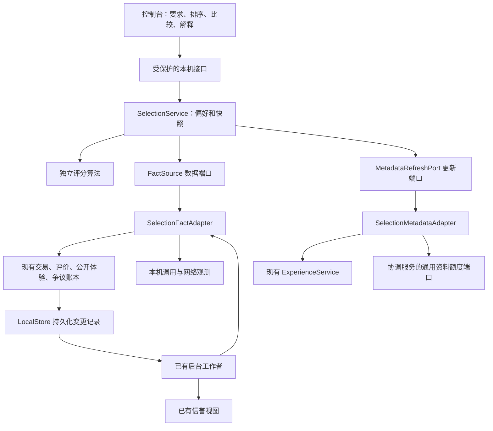

# 本机个性化评估模块：实现与接口

版本：`a2n-selection/1` · 2026-10-09。

新增私有条件整理 `POST /v1/selection/interpret`、选用绑定 `POST /v1/selection/choices` 与实际效果 `GET /v1/selection/outcomes`。自然语言只给确定性提示；关键词匹配、自定义任务类别和支付条件继续在发现后的展示与评估层处理。选用可记录从本次发现开始到确认选择的实际时间；旧会话没有起始时间时保留未知。效果由合格交易与本机评审回填，人工均值与助手验收均值分别统计。

本文说明当前代码已经实现的功能和边界。[完整业务设计](PERSONALIZED-AGENT-SELECTION.md)保留长期目标；未获得相应事实时，当前实现明确返回未知。

## 1. 业务闭环

1. 协调发现负责取得签名候选、引荐关系和通道，不携带本机的质量、信用或积分偏好。
2. 本机评估读取固定版本的候选和本机已有资料，先检查硬条件，再计算适合度。
3. 控制台展示满足要求、待确认和不满足要求的候选。筛选不会删除发现池；用户可以显示不满足条件的候选。
4. 用户明确选择补资料时，才查询作者签名的公开体验。更新作业与发现共用额度。
5. 调用完成后，单独记录本机交互观测；有效评价、改评、公开撤回和争议变化进入持久化更新队列。
6. 后台更新已有信誉视图和本机评估输入。排序接口读取现有输入，显示尚待更新的项目数。

推荐不执行 Agent，不占用前十次免费样品，不创建支付或积分结算，不自动切换本机机会策略。

发现的候选数量停止条件与个人适合度满意条件分别展示。资料不足时可以补资料、继续发现或主动选择未知候选；没有“已经搜遍全网”的结论。

## 2. 模块职责与依赖



| 文件 | 职责 | 允许的依赖 |
| --- | --- | --- |
| `selection/contracts.py` | 数据、存储、事实和补资料端口 | 标准库 |
| `selection/metrics.py` | 归一化、去重、衰减、质量、信用、时间、网络计算 | 端口数据与标准库 |
| `selection/scoring.py` | 硬条件、八项适合度、供应方分散和新人展示 | 纯计算模块 |
| `selection/service.py` | 本机偏好版本、不可变排序快照、分页、解释 | 上述纯计算与注入的端口 |
| `selection_adapter.py` | 将已有账本和声明转换成合格的评分事实 | 已有账本、协调候选、只读机会状态 |
| `selection_refresh.py` | 明确发起的公开体验更新、作业状态、停止 | 现有体验查询与通用额度端口 |
| `feedback_schema.py` | 统一定义评价维度及版本 | 标准库 |
| 节点 `daemon.py` | 组装端口，连接已有后台工作者 | 各服务实现 |

评分核心没有网络、支付、积分、争议、节点身份或数据库实现的导入。自动依赖检查限制它的导入范围。支付子模块没有引入评估模块。

评价账本只保存意见；公开体验保存作者愿意发布的意见；已有信誉模块保存公开聚合；选择器保存本机本次需求下的派生推荐。它们复用同一份评价原件和维度目录，没有新增第二套交易、信用发行或财务账本。

## 3. 算法及资料口径

默认权重：匹配 20%、质量 25%、信用 20%、可靠性 10%、交互时间 10%、网络 5%、成本 7%、个人偏好 3%。用户可以调整，合计必须为 100%。

各项输出包括 `value`、`status`、支持量、原始单位、原因及记录指纹。状态为资料充分、资料有限、暂无记录、资料过期或资料冲突。未知值用于排序时占中性位置，但接口里的数值仍为 `null`，最低分要求不能据此算通过。

| 维度 | 当前事实与规则 |
| --- | --- |
| 匹配 | 能力、输入输出格式、标签、语言声明；声明匹配不代表交付保证 |
| 质量 | 已交付交易的有效评价，1–5 归一为 0–1；按商品版本，已知的本机任务能力分组；个人体验可影响个人推荐 |
| 信用 | 遵守约定评价、合格的承诺履行资料、争议处理体验；争议次数单独展示，不直接扣分 |
| 可靠性 | 已确认的交付与可归因于 Agent 的失败；网络不确定结果保留未知，不冒充失败 |
| 交互时间 | 本机单调时钟实测总等待，按版本、能力、输入规模桶；保留未知和超时，缺少恢复后的完整时段不编造用时 |
| 网络 | 本机当前观测周期的入口可达、RTT 和抖动；30 秒桶去相关，不能将 TCP 可达当作任务成功 |
| 成本 | 同一币种或积分发行方内，按个人理想与最高预算计算；区分 EARN、DEBT、PAY，不推断跨发行方汇率 |
| 个人偏好 | 用户明确选择的输出风格；没有声明或偏好时保留未知 |

归一化使用固定锚点，候选里加入一个极端值不会改变其他候选的分数。外部意见按交易和作者去重、采用有效最新版本、保留原交易时间、限制同一作者的总贡献；不同 DID 不等于已证明的独立个人。

总体质量沿用原评价，未把旧评价解释成准确率或完整率。多能力服务缺少任务口径时标资料有限。2026-10-09 增加[任务级评审与本机校准](TASK-QUALITY-CALIBRATION.md)：指定 rubric 时通过独立只读端口读取同商品版本、能力、类别和规模的评审。没有该口径记录时返回未知，不使用总评冒充细项，不暗中调用外部模型。

### 信用中的争议

- 质量低分不自动变成信用低分，旧“沟通”“需求明确”评价不自动变成“遵守约定”。
- 记录争议才允许在本机填写“争议处理体验”；只有投诉、关闭或撤回争议，不产生信用奖励或确证失信。
- 主观处理体验与确认的承诺违背分开。已经计入同一交易的确证违背，不再用相同行为的处理评价重复扣分。
- 单一外部作者的负面处理评价不能触发合格的外部负面压力；需有至少三个对手组、足够有效质量和已完成的来源覆盖。
- 来源暂不可达时，只保留上次完成查询中已合格、仍有效、未撤回且未冲突的负面原件。新取到的不完整意见不能借用旧覆盖证明。
- 真实撤回、冲突或缓存过期会移除对应贡献；机会限制的保持和到期仍由原策略模块管理。

默认推荐展示前五项时限制同一供应方占位，并为新供给保留探索机会；探索不能越过硬条件或本机明确屏蔽。没有足够不同供应方时才回填空位。

## 4. 硬条件与估价

支持能力、输入输出格式、支付方式、积分模式、供应方、版本、最低质量、最低信用、资料支持要求，以及多币种／多发行方预算。

同一条件组中的多个选项表示接受其中之一，不同条件组同时成立。本次任务要求与已保存的个人要求同时检查。每条条件均返回 `PASS / UNKNOWN / FAIL`。

当前费用来自签名声明的每次估价或积分条件。缺少用量、发行方预算或支付条件时保留未知。EARN 的使用方成本与 DEBT/PAY 分开；选择 PAY 后不会用 EARN 的零成本通过预算。非零货币费用和积分条件可以分别展示；积分服务的零货币标价不自动当成免费。

推荐里的估价不授权成交。调用前仍由现有支付协调层确定实际报价、试用资格、欠账、接受条件和结算计划。前十次样品由业务层绕过全部结算。

## 5. 数据与恢复

全部新增私有数据保存在本节点已有加密 `LocalStore`。

| 命名空间 | 数据 | 是否公开 |
| --- | --- | --- |
| `selection_profiles`、`selection_profile_versions` | 偏好及历史版本 | 否 |
| `execution_observations` | 实测等待、能力、粗输入规模、来源及完成状态 | 否；不保存输入文本 |
| `store_changes` | 通用变更序号和对象引用，随原对象事务写入 | 否；不保存正文 |
| `selection_projection`、`projection_jobs` | 消费位置和待更新代次 | 否 |
| `selection_inputs` | 合格原件的派生事实 | 否；主体索引使用本节点秘密 HMAC |
| `selection_snapshots`、`selection_snapshot_sizes` | 固定输入下的推荐和解释 | 否 |
| `selection_refresh_jobs`、`selection_refresh_commands` | 有界资料作业及幂等引用 | 否 |
| 原评价、公开体验及信誉命名空间 | 沿用原账本 | 只有明确公开的体验对象对外提供 |

调用请求、私人原因、凭据、结算授权不会进入评分输入或解释。来源指纹最多返回 64 个，同时提供总数及截断标记。

后台变更流程：原件与变更序号同事务写入 → 更新游标和持久化任务 → 工作者计算固定代次 → 保存派生资料 → 仅在代次仍相同时清除任务。失败后任务保留；重启后恢复，启动时会重建已有事实的派生视图。没有业务事件时也周期检查期限和衰减。

网络记录只使用启动后或手动重置后的观测周期。VPN、出口或连接环境变化时，可在控制台清除旧周期。首版没有宣称能自动准确识别所有网络环境变化。

快照最长有效 30 秒，或先到期的输入期限；同一快照分页不偷偷改变排序。保存最多 7 天、128 份、50 MiB，单份最多 16 MiB；超过缓存限额只淘汰可重建推荐，不删除交易、财务、争议或样品。该额度只管理推荐快照，没有声称覆盖全部历史账本。

## 6. 本机 API

全部接口沿用本机管理认证；公网入口不能访问。

| 接口 | 行为 | 远程访问 |
| --- | --- | --- |
| `GET /v1/selection/profiles` | 偏好列表 | 无 |
| `GET /v1/selection/profiles/{id}` | 偏好、版本 | 无 |
| `PUT /v1/selection/profiles/{id}` | 更新，要求 `If-Match`；旧版本冲突返回 409 | 无 |
| `POST /v1/selection/profiles/{id}` | 同一更新操作的本机兼容入口，正文含 `expected_revision` | 无 |
| `POST /v1/selection/rank` | 按已有发现引用生成快照 | 无 |
| `GET /v1/selection/snapshots/{id}` | 固定快照分页，游标绑定输入指纹与页大小 | 无 |
| `GET /v1/selection/snapshots/{id}/explain/{candidate_key}` | 本次推荐依据 | 无 |
| `GET /v1/selection/subjects` | 商品、供应方或使用方的本机信用资料 | 无 |
| `POST /v1/selection/refresh` | 明确的公开体验更新，返回作业引用；要求 `If-Match` 和 `Idempotency-Key` | 有界 |
| `GET /v1/selection/refresh/{id}` | 作业与额度使用 | 无 |
| `POST /v1/selection/refresh/{id}/cancel` | 停止后续请求；已经发出的单项可结束 | 无新增访问 |
| `POST /v1/selection/network-context/reset` | 停用以前网络周期的观测 | 无 |

排序请求例子：

```json
{"search_id":"已有搜索标识","result_revision":3,"profile_id":"balanced","task":{"workload_bucket":"small","output_mode":"application/json"},"limit":100}
```

补资料最多选本次发现中两个已核验候选，分别读取服务质量与供应方信用。每会话累计最多 24 次元数据操作、512 KiB、5 秒墙钟预约额度；还必须有发现的本轮和总额度余额。额度先预留再发请求，失败、取消或重启不回退预约，不允许靠重试或续查重置资料累计上限。

实际网络由现有体验查询器完成：最多四个查询作业、两个工作线程、每来源最多两页，所有子查询共享批次截止时间。已知但因来源数量上限未读取的来源，计入未完成范围，不能伪装成“已知来源全查完”。资料完整仅描述本轮已知来源，全网完整性仍为未知。

## 7. 评价兼容

- 旧 `a2n-feedback/1`、`a2n-public-feedback/1` 按原含义读取。
- 使用“遵守约定”或“争议处理体验”时生成版本 2；原维度、签名摘要、交易锚点、修订和撤回链沿用已有结构。
- 私人反馈与公开短评继续分别保存；公开需要用户明确选择。
- 信誉按实际维度输出算法版本；既有历史计算记录保留。本机评估采用独立的需求口径版本，不覆盖原始评分或财务事实。

## 8. 已验证与当前限制

验证资料：

- `artifacts/selection-regression-2026-10-08.xml`：638 项全量回归通过。
- `artifacts/selection-boundaries-2026-10-09.xml`：收尾修改后的评估、评价、信誉策略、发现和依赖边界测试。
- `artifacts/selection-runtime-2026-10-09.xml`：72 项调用与评估测试；`selection-final-2026-10-09.xml`：最后的 62 项模块和完整 SDK 启动测试，均通过。
- `artifacts/selection-acceptance-2026-10-08.json`：一个 Windows 节点、三个独立 Docker 节点，以及实际文本分析 Agent 的验收。
- `artifacts/selection-console-2026-10-08.json`：真实 Chrome 的偏好、排序、解释、待确认和双方信用查看验证。
- `artifacts/selection-bundled-doctor-2026-10-09.json`：新版 Windows 单文件安装包通过五个产品包、评估模块及底层运行能力自检。
- `artifacts/selection-rollout-2026-10-09.json`：既有 Windows 节点与三个常驻 Docker 节点升级，核对原身份及历史调用、样品、评价、争议和积分记录。
- `artifacts/selection-installed-2026-10-09.json`：30 项业务检查通过；上述四个实际安装节点完成 12 次文本服务调用、前十次固定公开样品、双方版本二评价、自动改评、跨节点评价验签与派生更新、累计资料额度及重启恢复。
- `artifacts/selection-installed-console-2026-10-09.json`：新版安装程序中实际控制台的八维偏好、评分解释、只读排序及浏览器错误检查。
- `artifacts/selection-upgrade-tests-2026-10-09.xml`：16 项签名升级及桌面并发启动回归验证通过。

已验证排序不重复调用或消耗样品、评价修订只更新当前贡献、公开撤回移除外部贡献、投诉不会直接判失信、停止及重启保留状态、快照分页稳定、未认证请求拒绝、只读排序不访问远程接口。

任务 rubric 的有界检查、人工细项及本机实际体验校准流程已接入，真实资料不足时保留默认。八维初始权重、收缩强度和信用门槛没有被宣称已校准。任意代码的独立执行验证、模型语义评审、精确流式首个有用片段、跨任务客观基准及真实跨网络表现，尚不能用当前受控验收替代。缺少相应事实的指标如实返回未知或有限支持。

2026-10-09 已将既有开发环境升级到本实现：Windows 使用原目录 `data/desktop-sdk`，实际运行新版完整 `A2N.exe`，本机入口为 `http://127.0.0.1:8771/console`；三个常驻 Docker 节点继续使用原数据卷、加密密钥、端口与协调网络设置。四个节点的原身份不变，原有业务记录核对通过，原默认偏好和信誉策略保持一致。此前的临时节点验收与本次常驻节点验收分别保留报告。

Windows 更新通过现有签名升级流程完成：由本节点身份签名本次本机维护版本、备份后切换程序、核对实际运行文件摘要，再登记安装成功。这是本机自签维护记录，不代表已建立面向公众的发行者信任体系或操作系统代码签名。旧安装程序及加密备份保留；本次自动生成的备份恢复口令以 Windows 加密器封存于原节点的 `backups` 目录，不出现在验收报告或日志中。当前用户登录入口指向新安装程序；既有受保护的计划任务仍通过读取 `installation.json` 交接到安装程序。

Docker 镜像版本为 `a2n-selection:20261009`，兼容现有部署名 `a2n-node-test`；原镜像保留为 `a2n-node-pre-selection:20261009`。升级前各数据卷已生成经 SQLite 完整性检查的加密业务数据库快照。升级只作用于三个节点容器，实际 Agent 服务和其他应用继续运行。

同日已进一步升级任务评审与本机校准版本，当前镜像为 `a2n-task-quality:20261009`，仍兼容部署名 `a2n-node-test`。完整回归 654 项、常驻节点业务 18 项和浏览器操作 10 项均通过。新的模块边界、数据资格、实测校准门槛及当前默认状态见 [任务评审与校准说明](TASK-QUALITY-CALIBRATION.md)。此前的验收记录保留。

常驻节点验收脚本为 `scripts/installed_selection_acceptance.py`，浏览器只读检查为 `scripts/installed_selection_console_check.js`。业务验收每次创建独立服务与私人偏好，使用已有的实际文本 Agent；成功的受控服务保持可用，样品与反馈明确标注验收来源。失败运行只撤下本次新服务，保留已经产生的真实调用和样品记录。服务定价为零，前十次走样品免费阶段，之后走零价格阶段；全部受控调用均未产生积分结算。默认偏好、既有信誉策略和积分账本在验收前后保持一致。
