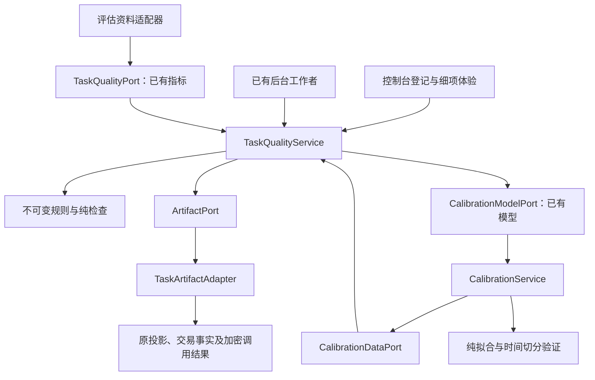

# 任务级质量评审与本机实际体验校准

版本：`a2n-task-review/1`、`a2n-local-calibration/1` · 2026-10-09。

本轮新增独立代码用例、授权语义接口、实际图像/音频/视频/文档规格检查；见 [评审与执行边界](WORKFLOW-MEDIA-MAINTENANCE.md)。后台检查与付款恢复分别运行，解析不占交易事务。`POST /v1/task-quality/plans/{id}/recheck` 使用 If-Match，按原规则重新检查原交付，保留本人体验、来源和历史，不再次调用 Agent。已有有效检查不会被临时不可用覆盖。

## 1. 业务流程

1. 使用者选择任务口径，调用前登记自己关心的检查条件；规则版本、细项和来源权重固定。
2. 询价和执行继续使用原支付协调流程。登记、评审、拟合与排序本身都不执行 Agent、不占用样品、不创建结算。
3. 实际交付后，后台读取本机持有的合格结果，执行有界的 JSON／文本条件检查。
4. 使用者填写细项体验，也可以明确委托助手代用、代评。保存 `HUMAN`／`ASSISTANT` 来源；未填项保持未知，修订替换原贡献，旧版本保留；可以停止使用整份评审。
5. 用户另行选择是否允许这份实际体验用于本机校准。默认未授权，受控测试即使勾选也不会进入生产校准。
6. 足够资料到达后显式试算，用未参与拟合的后续记录验证。通过门槛的模型才可以应用，也可以恢复默认。

原双方评价、公开短评、信用、争议和机会策略继续按原规则工作。任务细项不自动复制为总评，不自动公开，不直接扣信用，不改变积分账本。前十次样品仍固定公开，并由业务层绕过全部结算。

## 2. 固定任务口径

每个 rubric 固定 `id + version`、类别、细项权重、客观／使用方体验来源权重及独立的校准目标。原 `human` 字段保留兼容，实际评价者由 `label_source` 说明。相同版本内容不可覆盖，定义摘要进入计划、评审和模型。

| 内置口径 | 细项权重 |
| --- | --- |
| 结构化结果 | 正确 35%、完整 25%、格式 20%、有用 20% |
| 文本提取与表达 | 正确 30%、完整 25%、表达 20%、有用 25% |
| 代码交付 | 需求覆盖 35%、格式 15%、可维护 25%、有用 25% |

人工评分 1–5 归一到 0–1。客观细项按所选条件通过比例归一，支持字段存在、值相等、文本包含、类型、数字范围和长度范围。

适用但未测的项目在合成时占中性位置，明确返回未知及缺失权重，不把剩余权重分给已知项。只检查格式不会获得满分。不同口径、商品版本、能力、任务类别或输入规模不混在同一平均中。单笔修订不增加票数，少量记录仍显示资料有限。

实际结果必须属于本节点作为使用方的已交付交易，关联已核实，且结果摘要与交付账本一致。没有交付不能评分。登记时已有交易的回看评审标为有限资料，不进入生产校准。已知自供自用不作为独立供需贡献。

输入规模可以在交付后由原调用观测确定；显式预设的商品、能力或规模不符时，标记口径不一致。检查结果只保存规则摘要与通过与否，派生资料和排序解释不含原始任务或结果正文。

每份最多 64 项检查，结果最多 1 MiB。本模块不执行供应方提供的程序。代码口径支持结构要求与人工体验，供应方自报“测试通过”不能冒充独立测试。任意代码执行与模型语义评审需要独立受控评审器及明确授权，不会自动向外部模型发送任务。

## 3. 校准的数据资格

拟合接口不能上传任意训练数据，只读取已有评审的数据端口。合格数据同时满足：

- 明确为实际使用，用户允许用于校准；
- 规则在调用前登记，实际关联交付完成，没有已知自供自用；
- 同一口径、类别、能力及规模，客观可测细项覆盖至少 80%；
- 有使用方本人或明确受托助手给出的独立“有用程度”标签，该标签不参与客观预测值计算；
- 记录和标签时间有效，属于近 90 天，未撤回；同一交易采用当前修订。

实际执行的验收调用仍是受控测试。调用次数、样品数量、争议次数、未提供标签的交易和旧总体评分，不被猜测成该任务的目标标签。

明确受托的实际任务可以形成助手使用资料，必须注明评价来源并使用独立任务类别。本人评价和助手代评不混合拟合；遇到混合来源时返回 `EVALUATION_SOURCES_REQUIRE_SEPARATE_CONTEXTS`。助手资料的任务质量保持有限支持，并在评分解释、校准统计及模型支持量中显示来源；它不代表本人满意度或独立用户群体。

## 4. 校准算法与应用

1. 每供应节点最多取最近 100 笔，每次最多 1,000 笔；训练与验证时，各供应节点总权重相同。
2. 至少 40 笔合格记录、3 个供应节点和 3 天记录。不同节点不代表已证明的独立自然人。
3. 人工目标需要有足够变化，一批相同标签不能证明有效关系。
4. 按标签形成时间切分：较早约 80% 训练，较晚至少 8 笔验证。训练至少 3 个供应节点，验证至少 2 个。
5. 使用单调回归（保序回归），在固定结点间插值，输出限于 0–1，保持原客观预测顺序。
6. 后续验证均方误差相对默认映射至少改善 5%，且绝对改善至少 0.000001，平均绝对误差不能变差。
7. 验证后不将验证集重新加入拟合，应用的就是已验证的结点。

门槛是版本化的保守准入规则，不等于总体统计保证。模型描述本机检查与本人使用效用的关系，不是客观正确概率，也不证明全网或未来效果。

试算不自动改变推荐。应用要求明确操作和版本条件，并保存历史。校准只替换质量中已测客观来源的效用映射；人工细项、未知权重、原检查值、个人八维权重、预算和信用门槛保持原值。

模型最长有效 30 天。读取活动模型时核对资料引用、规则摘要和当前资格；撤回同意、改评、停止使用、资料超期或口径失效，会使原模型回到默认。新记录可用于下一次显式试算。

## 5. 架构与隔离

规则、生命周期和校准服务只依赖标准库与注入端口。只有 `task_quality_adapter.py` 认识既有业务账本结构；节点负责装配，付款页面通过可选的前端登记接口连接。交易、支付、积分、网络与旧评价模块没有导入新服务。

排序只读既有评审及活动模型，不执行检查、拟合、调用或网络查询。检查在后台进行，失败独立捕获，不能中断旧评价更新、调用恢复和积分恢复。

## 6. 本机接口与数据

全部接口受原本机管理认证保护，没有公共任务评审或训练数据接口。

| 接口 | 行为 |
| --- | --- |
| `GET /v1/task-quality/rubrics` | 读取口径 |
| `POST /v1/task-quality/rubrics` | 注册不可变版本 |
| `GET /v1/task-quality/plans` | 最近 100 份计划与评审 |
| `POST /v1/task-quality/plans` | 登记，重复相同计划幂等 |
| `GET /v1/task-quality/plans/{id}` | 本机详情 |
| `POST /v1/task-quality/plans/{id}/review` | 细项修订／撤回，要求 `If-Match`；可注明 `label_source` |
| `POST /v1/task-quality/plans/{id}/cancel` | 取消等待计划 |
| `GET /v1/calibration/status` | 指定上下文的资料资格和活动状态 |
| `POST /v1/calibration/fit` | 显式试算，要求幂等标识 |
| `GET /v1/calibration/models`、`.../{id}` | 固定模型和验证报告 |
| `POST /v1/calibration/activate` | 应用／恢复默认，要求 `If-Match` |

新增私有命名空间：`task_rubrics`、`task_review_plans`、`task_reviews`、`task_review_versions`、`task_quality_diagnostics`、`calibration_models`、`calibration_commands`、`calibration_active`、`calibration_active_versions`。沿用原加密数据库。上限为 100 个等待计划、5,000 个计划和 128 个试算模型；到上限明确提示，不删除真实交易或财务记录。

推荐请求可指定 `task.rubric`（如 `structured-output@1`）和 `task.task_class`。解释包含口径摘要、范围、已测权重、资料摘要及活动校准版本。一般评价继续按原含义读取。

## 7. 工程验收与实际校准的边界

规则登记、交付关联、后台检查、人工修订与撤回、任务推荐、真实资格筛选、拟合、后续验证、应用、回退与失效构成可运行闭环。

算法测试使用明确夹具验证拟合效果，夹具不导入常驻节点。常驻节点验收使用真实文本 Agent，标记受控测试，验证评分、隐私、恢复及资格排除。实际使用资料不足时部署状态保留默认，不能将工程验收写成已完成真实参数校准。

本版学习任务检查与个人效用的关系，没有自动学习八维偏好权重或信用惩罚门槛，也没有用本机测量替代真实跨电脑网络验证。

### 2026-10-09 实际安装验收

- `artifacts/task-quality-full-regression-2026-10-09.xml`：654 项全量回归通过，无失败、错误或跳过。
- `artifacts/task-quality-final-boundaries-2026-10-09.xml`：15 项任务评审与校准测试通过，补充核对校准只改变已测客观贡献、保留人工评分和未知权重，以及模型到期、改评失效和幂等冲突。
- `artifacts/task-quality-bundled-doctor-2026-10-09.json`：Windows 完整程序通过五个包及任务评审、校准能力自检。
- `artifacts/task-quality-rollout-2026-10-09.json`：12 项升级检查通过；原 Windows 节点和三个 Docker 节点启用新模块，原身份、调用、样品、评价、争议和积分记录核对通过，升级前备份保留。
- `artifacts/task-quality-installed-2026-10-09.json`：18 项常驻节点业务检查通过。复用已上架的真实 Python 文本分析 Agent，两个使用节点各完成一次实际调用；验证调用前定规则、后台检查、人工改评、版本冲突、撤回后的推荐、重启恢复、测试数据排除及未验证模型拒绝应用。两次调用均绕过结算，已有十份公开样品保持十份。
- `artifacts/task-quality-console-2026-10-09.json`：10 项真实 Chrome 检查通过，包括三种任务口径、未保存草稿保留、人工体验修订、校准资格提示、调用页登记接口和取消未执行计划；无脚本运行错误。

控制台入口为 `http://127.0.0.1:8771/console`，在发现页展开“任务评审与实际体验校准”。勾选下次调用登记、选择口径并添加要求，再到付款与调用页询价及执行；交付后回到任务评审填写本人体验。允许校准需单独勾选。排序的“本次质量口径”可以选择总体质量或具体任务口径。

这一轮升级的 Windows 程序摘要为 `53714d6cffe8b6e3931814f278c847ff0f2b91452173776a3f62ff7d8b1a32e9`，镜像为 `a2n-task-quality:20261009`；原节点目录、网络与支付配置沿用原值。

这一轮受控验收收尾时，默认口径的合格真实使用记录为 **0**，活动校准为 **DEFAULT**，没有等待中的测试计划。受控验收记录及修订历史留在本机，不用于生产训练。后续受托使用见下一节。

### 同日追加：用户委托助手实际使用

用户明确要求助手自行调用验证后，以项目文档盘点为实际用途，经 Windows 买方节点调用三个 Docker 供给节点的真实 Python 文本处理 Agent，完成 **42 笔不同文档片段的交付**。各供给节点 14 笔；前三十笔按各自前十次规则固定公开为样品，其余十二笔按零价格调用。全部绕过结算，积分账本摘要前后相同。

本批调用结果用于生成 `artifacts/project-document-inventory-2026-10-09.md`，人工风格细项由受托助手评审并保存 `label_source=ASSISTANT`。中文单字词频及截断预览的局限来自实际输出判断，有用程度为 2–4 分；客观结构检查均通过。这些体验与默认本人口径分开，类别为 `project-document-inventory-assistant`。此前 `CONTROLLED` 验收记录的来源和资格未改写。

本批资料状态：**42 笔合格受托使用记录、3 个供应节点、1 个实际日期，助手代评 42 份、本人评价 0 份**。数量和节点数达到试算门槛，实际日期不足 3 天，所以本次试算 `INSUFFICIENT_DATA`，活动模型仍为 `DEFAULT`。日期按真实调用时间计算，没有改写时钟；达到日期门槛后仍需后续记录验证确有改善。三个节点位于同一电脑，并使用同一个文本处理服务；本批不作为独立自然人或真实跨网络数据。

新增证据：

- `artifacts/task-quality-delegated-use-tests-2026-10-09.xml`：43 项模块和接口回归通过，包含受托调用正常计数、评价来源保留、混合来源拒绝拟合及未知来源拒绝。
- `artifacts/delegated-use-rollout-2026-10-09.json`：12 项常驻节点升级和原记录保留检查通过；新版 Windows 摘要为 `98c93310d1e57e50a91291d1cfb3380030f69f5c48aabc11fbc698427e2f86c0`，当前 Docker 镜像为 `a2n-delegated-use:20261009`（部署名仍为 `a2n-node-test`），原镜像保留为 `a2n-node-pre-delegated-use:20261009`。
- `artifacts/delegated-use-bundled-doctor-2026-10-09.json`：完整程序五个包自检通过。
- `artifacts/project-agent-usage-2026-10-09.json`：42 笔实际使用、返回结果、独立细项判断及校准试算。
- `artifacts/project-agent-usage-verification-2026-10-09.json`：11 项安装节点检查通过，包括实际计数、各节点十份样品、来源、三供给任务推荐、旧测试资格保留及默认回退。
- `artifacts/delegated-use-console-2026-10-09.json`：5 项浏览器检查通过，显示 42 笔、3 节点、1 天以及本人／助手来源，未解锁应用按钮，无脚本运行错误。

再次执行采集脚本时沿用本批任务及评审标识，已完成任务不会重复调用；它不会以重跑相同数据来制造新日期。后续校准需要后续真实用途、实际交付和新的使用体验。
