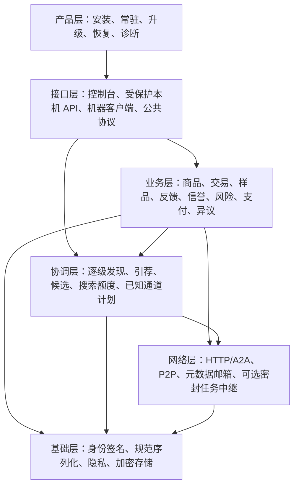
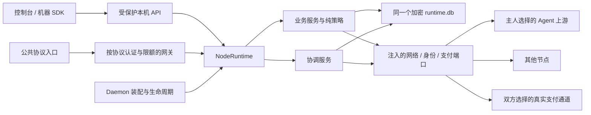
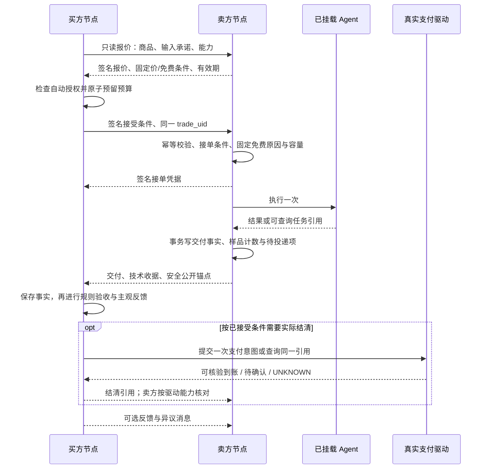

# 愿景补齐：详细架构设计

版本：v0.1 · 2026-10-05（Asia/Shanghai）。状态：**待实施的架构设计稿**。

配套业务规则见 [详细业务设计](VISION-BUSINESS-DESIGN.md)。当前实现边界见 [现有 SDK 架构](SDK-ARCHITECTURE.md)、[节点统一](NODE-UNIFICATION.md)、[本轮评估](../artifacts/REVIEW-2026-10-05.md) 和 [修复记录](../artifacts/FIX-2026-10-05.md)。本文的新增模块、协议和 API 是实施目标，不代表当前节点支持。

## 1. 架构目标与约束

1. 保留唯一产品装配：`Daemon → NodeRuntime → LocalStore(runtime.db)`。每个节点都是同一套平台；Docker、Windows 和服务器只在产品部署方式上不同。
2. 保留五个包，不恢复中央交易平台、全网评分服务器或第二套业务运行时。
3. SDK 业务规则可在没有真实网络、支付和 GUI 的情况下复算；节点包负责身份、网络、加密及产品适配。
4. 业务事实、公开投影和本地决策分别保存。评分可重算，付款事实不能被重新评分改写。
5. 公共发现始终是有界元数据服务；新增评价、异议与付款能力不改变发现协议的权限。
6. 默认公共样品只包含安全投影；私有任务、输入、凭据、支付账户不进入目录、邮箱日志或信誉缓存。
7. 跨节点采用幂等与对账。不能承诺网络上的恰好一次交付、绝对完整评价或全网最短路径。
8. 产品安装后模块齐全，实际开放能力、费用授权与运行状态仍由主人配置和真实网络条件决定。

## 2. 六个逻辑层与五个代码包

### 2.1 逻辑分层



层是责任边界，不是六个独立服务。业务策略向协调层提供纯评估结果；协调层不得执行交易。接口的公共与私有入口分别装配，不能把整套本机 API 代理到公网。

### 2.2 包边界

| 包 | 当前职责 | 本次扩展职责 | 禁止承担 |
|---|---|---|---|
| `a2n-kernel` | 基础类型、规范数据及纯工具 | 可复用的承诺摘要、协议错误类型 | 网络请求、数据库、全局评分服务 |
| `a2n-p2p` | 身份、签名与底层连接能力 | 为新协议提供身份与传输原语 | 商品排序、交易条件、付款策略 |
| `a2n-acceptance` | 声明模板与验收实现 | 结果规则的版本化与解释 | 代替买方主观评价、宣布付款 |
| `a2n-sdk` | Runtime、Store、调用、协调契约、样品、反馈 | 交易事实、体验索引、信誉、机会策略、额度、异议状态机 | 导入 `a2n_node`、绑定支付厂商、强依赖第三方库 |
| `a2n-node` | Daemon、网络/身份适配器、公共入口、CLI | 新协议网关、支付适配器、资产传输、安装与生命周期 | 再实现一套信誉和试用规则 |

依赖方向延续现有规则：节点装配 SDK 与基础能力；SDK 通过 `Protocol` 接收身份、网络、验收及支付端口。确实需要第三方库的驱动放节点适配层，纯算法与状态机留在 SDK。新增文件不机械地拆成新包。

### 2.3 单节点装配



每个部署只持有自己的身份与私有记录；邻居、邮箱和可选缓存不是上级平台。一个节点退出不转移其资金控制权，也不使其他节点的本地评分无法运行。

## 3. 模块实施清单

以下文件名为**建议落点**，除“沿用”项外尚未创建；可在实现时按实际复杂度合并。

| 模块 | 建议位置 | 主要责任 |
|---|---|---|
| 商品与声明 | 沿用 SDK `cards.py`、`management.py`；node `supply.py` | 稳定商品键、表单、版本、可公开字段与固定价声明 |
| 交易契约 | SDK 新 `trade_contract.py` | 报价、双方接受、业务指纹、条件快照和协议版本 |
| 交易事实 | SDK 新 `trade_facts.py` | 执行/质量/免费/付款/退款/异议各轴，事实追加与兼容投影 |
| 交易编排 | SDK 新 `trade_service.py`；沿用 `calls.py`、`pipeline.py` | 接单、幂等、额度预留、执行、结果与后续对账 |
| 试用与样品 | 沿用 `trials.py`、`privacy.py`；扩展 `media.py` | 接单时免费条件、首十条固定槽位、自测标识、安全预览 |
| 双向意见 | 沿用 `feedback.py`；新 `feedback_public.py` | 原意见、修订链、公共安全投影、来源验证与可见范围 |
| 体验查询 | SDK 新 `experience.py`、`experience_service.py` | 多来源查询会话、预算、去重、覆盖与缺失说明 |
| 信誉计算 | SDK 新 `reputation.py` | 无 IO 的维度聚合、对手贡献上限、支持量、解释和版本 |
| 本地机会策略 | SDK 新 `business_policy.py` | 硬条件、新人展示、满意条件、接单风险与限制/恢复 |
| 风险额度 | SDK 新 `risk.py` | 按币种和授权范围原子预留、释放、UNKNOWN 保留与核对 |
| 支付编排 | SDK 新 `payments.py` | 支付/退款意图、驱动结果、对账状态；不包含厂商实现 |
| 异议协商 | 扩展 SDK `disputes.py` | 对方回复、方案、双方确认、离线送达与关联补做 |
| 持久事件与投递 | SDK 新 `events.py`、`outbox.py` | 事实和待投递项同事务；至少一次发送、消费者幂等 |
| 公共体验适配 | node 新 `experience_gateway.py`、`experience_identity.py` | 封套、签名、安全投影、地址与字节限制 |
| 交易/异议适配 | node 新 `trade_gateway.py`、`resolution_gateway.py` | 远端报价、接单条件与授权方协商协议 |
| 支付适配 | node 新 `payment_adapter.py` | 首个真实通道的提交、查询、到账核对、退款 |
| 媒体资产适配 | node 新 `asset_gateway.py` | 有界流式预览、访问令牌、加密文件与清理 |
| 产品生命周期 | 沿用 node `product_cli.py`、`desktop.py`；新 `lifecycle.py` | 单实例、统一 home、安装/升级/备份/恢复、自检 |

Runtime 负责装配、调用服务和状态快照，不把所有规则塞入一个越来越大的管理处理器。HTTP 处理器仅做认证、输入校验、调用服务、响应映射。

## 4. 核心实体与持久化

### 4.1 稳定身份与幂等

```text
candidate_key = (provider_did, service_id)
trade_uid = sha256(canonical_json([
    "a2n-trade-identity/1", buyer_did, provider_did, service_id, task_id
]))
business_fingerprint = hash(skill + input + business_options + accepted_contract_hash)
```

算法使用明确版本的规范序列化；任务 ID 默认由节点生成至少 128 位随机值。私有上下文与输入不直接用在公开可枚举的路径里。

业务指纹包括真正影响执行的输入和选项，不包括路由、连接 nonce、认证签名、诊断字段。两份输入如果只有传输字段不同，应指向同一交易；输入或接受条件改变必须返回冲突。现有调用指纹包含请求 metadata，迁移时保留历史指纹验证，新增协议显式区分业务与传输字段。

交易固定原始 Card、路由和远端任务引用。新通道用于新交易。只有供给方明确声明并实现跨通道的同一交易查询，才能在新通道查询原交易；查询仍不得重提交。对未知上游是否已执行的任务，不以改 task_id 绕过 UNKNOWN。

### 4.2 实体与唯一约束

| 实体 | 键/约束 | 保存内容 |
|---|---|---|
| `TradeAgreement` | `trade_uid`；原条件不可覆盖 | 双方、商品/版本、输入承诺、固定金额、免费原因、时间与条件签名 |
| `TradeFacts` | `trade_uid`、单调 `fact_revision` | 六类事实轴、证据出处、事件时间、观察时间、当前投影 |
| `TrialAdmission` | `trade_uid` 唯一 | 接单时进度、免费政策版本、并发/资源占用、授予原因 |
| `SampleSlot` | `(candidate_key, initial_slot)` 唯一；`trade_uid` 去重 | 1–10 固定槽位、安全投影、自测来源、隐私变更、质量状态 |
| `FeedbackRecord` | `(trade_uid, direction, author_did)` + 修订链 | 原作者意见、维度、可见范围、关联事实与签名 |
| `PublicTradeAnchor` | 不透明 `anchor_id`；绑定已签名关系 | 可公开主体、商品/版本、必要交付凭据与安全投影关联 |
| `PublicFeedbackProjection` | `(feedback_id, publication_revision)` | 脱敏后的可公开维度/短评、原意见承诺、撤回/更正与作者签名 |
| `ExperienceCache` | 原签名对象的身份/版本/摘要 | 原作者对象、来源链、接收时间、过期状态；不是新的一票 |
| `ExperienceQuery` | `query_id`、控制/结果版本 | 主体、版本范围、预算、来源、游标、覆盖与失败原因 |
| `ReputationView` | 主体/维度/算法版本/事实摘要 | 可重算结果、贡献组、排除原因、信息充分度 |
| `LocalPolicy` | `policy_id`、不可变版本 | 本机排序、额度、自动授权、探索与恢复规则 |
| `RiskReservation` | 交易/币种/用途唯一 | 单笔、日预算、在途与未结暴露；释放原因与对账状态 |
| `PaymentIntent` / `RefundIntent` | 原交易/用途/驱动幂等键唯一 | 最小单位整数金额、币种、驱动引用、状态与核验摘要 |
| `ResolutionMessage` | 异议 ID、作者、消息 ID 唯一 | 原签名回复/方案/确认；没有全网仲裁结论 |
| `LocalEvent` / `OutboxItem` | `event_id` / `delivery_id` 唯一 | 可重放本地事件、协议域、目标、尝试与送达状态 |
| `AssetDescriptor` | `asset_id`；私有文件映射 | 类型、大小、安全预览、访问范围、摘要与保留策略 |

沿用一个 SQLite 业务库。小数据先使用命名空间存储；交易、事件、投递和额度需要查询/唯一约束时增加表及必要索引。内容用注入加密器封装，只把查找必须的非敏感键、状态、时间作为索引；不将完整 Card、短评、凭据明文写日志。

大媒体可在节点私有资产目录存加密文件，描述和生命周期仍由同一业务库管理，不能另造一套交易数据库。文件先写临时对象、校验、原子提交，再登记描述；崩溃产生孤儿文件可按保留期清理，不能把“已登记”当作文件一定存在。

### 4.3 事实归属与状态推进

- 执行事实由执行节点及可核验的上游结果产生；买方保留自己的观察与远端收据。
- 规则验收由调用方的验收实现产生；卖方的技术交付签名先于买方验收，拒收不能阻止保留交付凭据。
- 付款事实来自真实驱动查询；退款必须关联原支付，不由质量分或异议 OPEN 状态生成。
- 主观评价由作者产生；对方仅能回复。
- 远端陈述与本机已核对事实分别记录。冲突不静默覆盖，晚到记录可补全 UNKNOWN，不能把已知交付改回未执行。

兼容旧 `CallOutcome`，对旧客户端保留 `state/ok/result/verdict/settlement`；新客户端读取版本化的事实对象。新事实不通过随意改旧状态枚举来实现，否则旧质量、反馈与试用判断会继续误用。

## 5. 接单、执行与结清流程

### 5.1 正常流程



图中以交付后结清表示一种可选模式。首个通道若采用预付，支付确认必须发生在执行前；只实现一个明确模式，不能仅移动图中的步骤就声称支持两种资金流程。

业务稿首轮建议小额后付：技术 DELIVERED 产生 DUE，确认没有交付的失败不收费。规则验收与主观意见不直接改写付款义务；事先约定的退款/补做通过独立意图处理。收费规则随合同明确版本化，不能继续用旧管线“验收通过才调用 SettlementPort”代替完整条件。

### 5.2 报价与试用一致性

报价不执行 Agent。报价可指明“接单时满足初始免费条件才接受”，买方免费授权的最高应付为零。接单时状态已变成收费，则返回 `QUOTE_CHANGED`，不得收费执行。

免费条件在卖方接单事务固定，报价有效期不锁住无限名额。进度 9/10 且免费并发上限 2 时可以多完成一次；固定前十个技术完成位置，额外免费交付另外保存。并发上限与资源预算共同控制损失。

已确认交付而规则失败，样品事务仍执行；未确认交付维持 UNKNOWN/FAILED，不伪造样品。样品资格由事实轴判断，彻底移除仅凭 `ok=true` 才记样品的隐含前提。

### 5.3 崩溃与投递一致性

接单时把任务占位、条件、资源预留与持久 READY 作业一起提交，并受现有执行并发/待处理容量约束。内存队列只唤醒执行器，不承担唯一任务记录。READY 可恢复派发；已标 RUNNING 而结果缺失的作业按未知执行处理，只有可安全查询/幂等的上游能力才允许继续，不能直接重新调用。取消尚未派发作业可明确释放预留，未知执行不能按未派发处理。

当前完成后的 `on_delivery` 是尽力执行的钩子。目标设计改为：

1. `TradeFacts` 更新、试用计数、固定样品槽位和 `LocalEvent/OutboxItem` 在同一 `LocalStore.tx()` 内提交。
2. 无网络、无支付调用、无大文件传输在数据库写事务中运行。
3. 提交后由后台消费者投递；失败退避，重启继续。消费者按事件或消息 ID 去重。
4. 不能因公开样品预览生成失败而丢弃已交付事实；先登记槽位与待生成状态，稍后补安全预览。
5. 邮箱 ACK 表示目标协议接收；最终业务确认、支付核验、双方达成方案另列，不能用“送达”表示“认可”。

这提供至少一次投递与本地一次计数。上游已执行但本机尚未写结果就崩溃时，若上游没有幂等/查询能力只能保持 UNKNOWN；不通过重启自动重新调用掩盖问题。

### 5.4 资金与风险

支付前原子保存意图与幂等键，然后在事务外调用驱动。驱动超时按原引用对账，不创建第二笔付款；UNKNOWN 保留相应预留。未发出意图、明确拒绝、确认退款与确认完成，各自有不同释放依据。

驱动必须支持双方各自权限范围内的核对，或返回收款方可验证的通道凭据；不能仅信买方填写的付款编号。资金凭据只注入支付服务，Agent 上游不获得根付款令牌。超过等待窗口转人工核对并停止增加同类暴露，不能把期限到达伪造成未扣款或已退款。

日预算按币种分别计，整数最小单位，不用浮点金额、不默默换汇。已确认支出不会因结束在途预留又恢复当天可花额度。跨日仍在途的额度继续占用总风险上限，不能借午夜清零绕过控制。

买方预付暴露与卖方后付未结暴露分别管理。卖方还设所有买方合计上限，减少换 DID 绕过单人限制。私有额度不公开给陌生节点，拒绝只回必要原因。

未配置支付驱动时，免费交易可进行；非零收费请求在执行前返回 `PAYMENT_UNAVAILABLE`。支付驱动失败、待确认和未配置不能包装为收费成功。未知状态可以人工核对，但人工备注与驱动确认的事实等级不同。

## 6. 签名、隐私与跨节点体验协议

### 6.1 三种不同对象

1. **私有交易记录**：保留原输入、原交付、完整条件、凭据和原签名意见，供双方自己查看。
2. **公开交易锚点**：只在需要公开样品或意见时生成，包含必要主体、商品/版本、角色绑定和技术交付证明。原始输入、原文件、账户和精确付款资料不随之公开。
3. **公开意见投影**：作者选择可公开维度和安全短评，投影完成后重新签名；关联原意见的承诺和修订链。

默认样品公开商品与安全预览，买方 DID、原任务 ID 保持私有，只有安全的不透明样品引用和带核验等级的来源类别。若公开反馈需要角色绑定，发布界面明确说明可公开的作者/交易主体。没有公开角色证据的样品来源声明不计作一个新的独立评价者。

不能改写已有签名对象的文字并保留旧签名。投影签名证明“作者发布了这份公开意见”；必要交易锚点证明可核对的角色与交付关系，两者均不能证明主观意见必然公正。

公开发布链包含 `feedback_id/publication_revision/previous_publication_hash`，更改公开范围与撤回都追加作者签名对象。以有效链的最新公开状态决定计权，不从未公开的私密修订推断内容。原作者离线时标明最后核对时间，不能保证缓存已取得最新撤回。

公开锚点优先复用双方自动签名的接单关系与卖方技术交付凭据，不要求对方批准这次低分。若只有作者自己的无远端凭据陈述，记录仍可展示，但不混进已核验交付质量维度。

低熵原输入的裸哈希可能被猜测，不默认公开。内部保留原摘要；公开绑定可采用带随机盐的承诺，盐只在有权核对时提供。公开预览摘要覆盖实际公开内容，不拿原文件哈希冒称预览可验证。

### 6.2 `a2n-experience/1` 新协议

这是**拟新增协议**，与当前 `a2n-coord/1` 分开。复用身份、规范序列化和封套原语，签名加入协议域，禁止跨域重放。正文有固定字段、版本、请求 ID、目标 DID、有效期与分页预算。

| 拟新增公共 POST 路径 | 操作 | 返回 |
|---|---|---|
| `/public/v1/experience/manifest` | `MANIFEST` | 本节点可提供的公开主题、版本、条数范围与能力 |
| `/public/v1/experience/summary` | `SUMMARY` | 当前公开记录摘要、覆盖说明、更新水位；不是可信全网分数 |
| `/public/v1/experience/feedback` | `GET_FEEDBACK` | 一页原作者签名投影、必要锚点、修订/撤回记录 |
| `/public/v1/experience/samples` | `GET_SAMPLES` | 样品槽位、安全预览描述与隐藏原因；不内嵌大文件 |

查询主体显式分成 `service/provider/buyer`，商品主体绑定 `(provider_did, service_id)` 和版本范围。没有授权不得返回私密意见；公共请求不通过任意 task_id 查询原始任务。

游标绑定查询主体、筛选、页大小和快照水位。结果变化返回 `RESULT_CHANGED`，已取得记录仍缓存；重开查询取得新快照。过期游标不能拿来无限延长会话。摘要缺失、来源失败和零条公开意见是三种不同结果。

### 6.3 多来源发现与验证

```text
已知商品和节点 → 读取声明的体验能力 → 查询卖方 + 已知作者/可选缓存
              → 验签和主体绑定 → 按原对象去重 → 检查修订链
              → 本地缓存与覆盖报告 → 本地信誉复算
```

公开作者可向已选择的缓存发布有界、带有效期的主题线索；缓存只能转发原对象。线索包含出处和索引摘要，不能嵌入待执行代码。第一版只搜索已知来源，不为了“完整”递归复制全网交易历史。

独立来源不可达时给出缺失项，不假设卖方的列表已完整。卖方删除自己缓存不能使买方保存或作者发布的意见消失；但作者离线且无人缓存时也不能保证陌生人一定找到它。

验签、交易锚点、角色、方向、维度资格、商品/版本、修订和期限逐项验证。多个缓存持有同一意见只是一份意见。相同作者同一修订有不同内容时标记签名冲突并隔离相关记录；没有真实签名的冒名不能归罪被冒充者。

### 6.4 协调邮箱的兼容边界

当前协调邮箱只支持六项协调操作，不支持上述新协议。扩展应新增**元数据邮箱 v2 能力**：明确协商 `a2n-coord/1`、`a2n-experience/1`、`a2n-trade/1`、`a2n-resolution/1` 的允许域，并按域分队列和限额。

- 老节点仍使用原六项操作，未经协商的新操作返回 `UNSUPPORTED_PROTOCOL`。
- 缺少 v2 的私网节点可用支持的直连体验入口；没有入口就显示体验不可取，不偷偷借 Agent 执行接口传查询。
- 交易域只传报价、接单与控制元数据；Agent 任务/大交付继续由明确授权的业务通道处理。
- 异议写消息必须由交易参与方认证；体验查询不能变成不受限收件箱。
- 仍只沿调用方指定、当前实现允许的有限转送路径。扩展域不自动允许任意嵌套转送。

协议能力用单独版本化的签名声明发布。当前 v1 数据类和签名校验可能严格校验字段，不能给旧 `NodeRecord` 任意加字段就认定兼容。新节点先按已支持形状握手，再协商扩展；没有共同版本则保留原发现能力。

### 6.5 容量与地址限制

各域独立限制请求体、响应体、并发、队列长度、时间和缓存字节；基础发现保留独立容量。建议体验元数据请求不超过 16 KiB、单页响应不超过 256 KiB、每页最多 50 条，均为待压力测试参数。大文件另行传输。

基础发现按已认证对手公平调度，并设全局上限；商品信誉和付款关系不决定其服务优先级。新公共路由逐项加入允许清单和对应认证处理器，不通过开放整个 `/public/` 前缀顺带暴露管理接口。

只访问通过目标签名声明并通过地址策略的端点。公网引荐不能授予回环/内网权限；DNS 重解析、重定向、目标 DID 不匹配、凭据转发都需受限。控制、体验与支付请求不使用大业务请求体上限。

## 7. 新增端口与本机 API

### 7.1 SDK 进程内端口

以下是逻辑接口，不替换现有 `ports.py` 中的签名。新端口先以小接口注入，避免向一个万能适配器添加全部职责。

| 端口 | 逻辑方法 | 边界 |
|---|---|---|
| `TradeContractPort` | `quote(target, spec)`；`admit(agreement)`；`query_admission(trade_uid)` | 不执行 Agent；允许返回 FREE_CHANGED/UNSUPPORTED |
| `ExperienceNetworkPort` | `fetch(source, query, deadline, response_cap)` | 返回原签名对象及实际来源/字节；不直接算信誉 |
| `IdentityProjectionPort` | `sign_public(domain, object)`；`verify_public(domain, object)` | SDK 不持有底层加密库；签名覆盖完整投影 |
| `PaymentDriverPort` | `capabilities()`；`submit(intent)`；`query(reference)`；`refund(intent)` | 返回核验状态和通道引用，不决定交易质量 |
| `ResolutionTransportPort` | `deliver(target, signed_message)`；`query_delivery(message_id)` | 只确认传送，不产生双方同意 |
| `AssetPort` | `store_private(stream, limits)`；`open_preview(asset_id, grant)` | 体积受限，返回描述/流；不接受任意文件路径 |
| `ClockPort` | `now()`；单调时钟读数 | 便于期限、衰减、跨日与故障测试；外部时间不能回拨预算 |

保留现有 `TransportPort/TaskControlPort/UpstreamPort/AcceptancePort`。现有 `SettlementPort` 是验收后调用的简单口径，不能直接承载预付与 UNKNOWN 对账；由兼容适配器映射新支付状态，真实编排采用持久意图。

### 7.2 拟新增受保护本机 API

以下复用现有本机来源、Host/Origin、配对令牌保护。变更命令用 `Idempotency-Key`；控制配置和协商状态使用 `If-Match`。实际后台进度另有版本，不使主人无法修改配置。

| 方法与路径 | 用途 | 关键响应 |
|---|---|---|
| `POST /v1/trades/quotes` | 只读获取/校验本次条件 | quote、能力、有效期与免费待接单条件 |
| `POST /v1/trades` | 授权并创建一笔交易 | 原交易或新 trade_uid、已接受条件、事实轴 |
| `GET /v1/trades/{trade_uid}` | 本地事实快照 | 执行、质量、免费、资金、异议与未知原因 |
| `POST /v1/trades/{trade_uid}/reconcile` | 查询同一任务/支付引用 | 对账进度；禁止重新执行/新付款 |
| `POST /v1/experience/queries` | 有预算的多来源查询 | query_id、来源与进度 |
| `GET /v1/experience/queries/{query_id}` | 读取查询状态 | 覆盖、缺失、结果水位、预算消耗 |
| `GET /v1/reputation` | 本地信誉视图 | 维度、支持量、出处与算法版本 |
| `POST /v1/reputation/rebuild` | 按既定版本本地复算 | 后台作业；不联网、不改变既往事实 |
| `PUT /v1/policies/{policy_id}` | 更新本地机会/风险规则 | 新不可变政策版本及生效范围 |
| `POST /v1/feedback/publications` | 发布/修订安全投影 | publication_revision 与作者签名 |
| `POST /v1/disputes/{id}/messages` | 回复或提出方案 | 原签名消息与送达状态 |
| `POST /v1/disputes/{id}/agreements` | 明确接受某方案 | 自己同意或双方达成；不自动产生退款到账 |
| `POST /v1/payments/{id}/reconcile` | 按驱动引用核验 | 核验出处、付款状态、预留处置 |
| `POST /v1/backups` | 创建可恢复快照 | 快照范围与密钥恢复条件 |
| `POST /v1/restores/validate` | 恢复预检 | 身份、解密、版本、空间与冲突报告 |

保留现有 `/v1/feedback`、`/v1/trials`、`/v1/calls/detail` 与协调 API，作为兼容投影，不并行维护新旧两套业务状态。老调用入口在免费模式可委托统一服务；非零价格且无法表达必要接受条件时拒绝并提示升级。

### 7.3 公开交易与异议协议

`a2n-trade/1` 的 `QUOTE/ADMIT/GET_ADMISSION` 采用签名封套；任务调用仍通过现有 HTTP/A2A 或密封中继适配器，在已签名请求中绑定合同摘要。卖方验证买方身份、输入承诺与接单条件后才能执行。

`a2n-resolution/1` 的 `DELIVER_MESSAGE/GET_DELIVERY` 只允许相关交易参与方访问，拒绝任意人修改争议。退款、补做作为独立授权动作，由统一业务服务创建关联意图，消息文字不直接触发付款或运行代码。

### 7.4 查询响应示例

下面展示字段语义，不是当前线上响应；签名对象另按协议完整返回。

```json
{
  "protocol": "a2n-experience/1",
  "subject": {"kind": "service", "provider_did": "did:a2n:provider", "service_id": "svc_x"},
  "snapshot": "opaque_snapshot",
  "items": [],
  "coverage": {
    "requested_sources": 3,
    "responded_sources": 1,
    "seller_only": true,
    "known_sources_complete": false,
    "global_completeness": "UNKNOWN",
    "missing_reasons": ["SOURCE_OFFLINE", "UNSUPPORTED_PROTOCOL"]
  },
  "next_cursor": null
}
```

`known_sources_complete` 只说明本次已知来源是否按快照查完；预算耗尽、分页未完成或来源失联均为 false。即使为 true，`global_completeness` 仍为 UNKNOWN，不表示全网历史完整。

### 7.5 错误与重试

| 错误 | 行为 |
|---|---|
| `UNSUPPORTED_PROTOCOL` / `CAPABILITY_MISSING` | 使用已知兼容只读路径，或显示该能力不可用 |
| `UNVERIFIED_IDENTITY` / `TARGET_MISMATCH` | 不信任该结果，不归罪被冒名主体 |
| `IDEMPOTENCY_CONFLICT` / `CONTRACT_CONFLICT` | 同键不同业务内容，停止重试 |
| `QUOTE_EXPIRED` / `QUOTE_CHANGED` | 接单前重新取报价并重新确认；已接单条件不变 |
| `RISK_LIMIT` / `CAPACITY_LIMIT` | 未执行；用户或已授权策略可等候，不自动加额度 |
| `PAYMENT_UNAVAILABLE` | 非零价禁止执行；不改成免费或伪造到账 |
| `RESULT_CHANGED` / `CURSOR_EXPIRED` | 重新开只读快照；已验证记录保留 |
| `RATE_LIMITED` / `SOURCE_OFFLINE` | 有界退避，计入预算，报告缺失 |
| `EXECUTION_UNKNOWN` / `PAYMENT_UNKNOWN` | 保留原引用与额度，只查询，不重复创建 |
| `PRIVATE_CONTENT` / `ASSET_NOT_AVAILABLE` | 展示占位与权限说明，不泄露原文 |

已认证协议请求的错误按对应域签名；无法认证时只回最小错误。网络重试消耗原查询/投递预算，不无限循环。

## 8. 信誉计算与业务满意策略

### 8.1 纯计算和解释

`reputation.py` 输入已验证且已投影的记录、事实资格、时钟、算法与政策版本，输出维度视图，不发请求、不执行调用。

沿用业务稿公式：当前版本意见去重 → 校验维度资格 → 自测排除 → 时效/版本权重 → 对手贡献封顶 → 中性先验聚合。有效支持量按对手组计算，禁止对同一对手每次重复交易分别增加“独立样本”。

输出记录：纳入/排除数量、各对手贡献、衰减因子、算法版本、输入摘要、信息充分度和数据覆盖。整数/小数的舍入与固定随机种子明确版本化，离线复算可比较。

机会门槛同时读取总有效权重、有效对手支持量与近期覆盖；不能让大量极旧、极低权重的组数单独满足处罚条件。状态变化记录触发的新合格事实，重复定时复算不伪造持续恶意的证据。业务稿 §9.4 的数值只作为影子试算配置。

大量关联 DID 的启发式只产生影响限制理由；不能宣称已识别所有独立用户。算法暂不递归引用作者的信誉作为权重，不因缓存节点自报分数高就增加票数。

### 8.2 策略执行

协调搜索仍负责 frontier、候选与路径观测。业务策略读取不可变候选、体验视图、价格与本地授权快照，返回 `SATISFIED/CONTINUE/NEEDS_INPUT` 和原因，不能创建交易。

慢体验查询独立运行，结果版本变化后重新评估。缺少信誉视图按“未知”处理，不把所有新人排除；未知是否符合当前自动调用风险，需要依主人配置明确判断。

展示排序、自动选择和卖方接单是三个权限范围。探索比例只影响展示。自动选择仍检查技能、价款、授权与风险；卖方接单仍检查原子容量。公共节点服务量不进入商业排序。

### 8.3 影子启用与恢复

分成 `DISABLED → SHADOW → SUGGEST → ENFORCE_LOCAL`。先保存影子排序和解释，不改变成交；用户可比较建议并启用。算法故障或迁移冲突可回到手动/旧数量策略，已经接受的合同继续按原条件执行。

NORMAL/OBSERVE/LIMITED/MANUAL_ONLY/BLOCKED_LOCAL 是本地机会状态，变化有政策、支持量与原因。撤销私密策略或改变参数不会删除公共原意见。恢复根据后续事实及衰减重新评估，单次差评和正常异议不形成永久禁用。

## 9. 媒体、Agent 扩展与授权

### 9.1 媒体分批实施

先支持安全文本、JSON、文件元信息与确认过的缩略图。原文件默认私有；公开描述不是可读取本地文件的路径。

完整媒体需要有界流式传输、Range/类型/大小验证、带宽配额和过期授权。当前公共代理存在缓冲读取响应的路径，新增大媒体前必须替换该路径；不能给业务 JSON 提高上限来支持视频。

预览渲染禁用脚本与主动内容；HTML/SVG 等不能直接作为可执行页面嵌入。下载独立授权，不向任意第三方 URL 自动附带凭据。访问令牌绑定资产、操作、期限和必要主体，不使用根管理令牌。

### 9.2 自动调用授权

使用有限范围的授权对象，包含商品/技能范围、单笔/累计金额、有效期、并发、网络与文件访问范围。节点签名不能替代主人的资金授权；对方 Agent 输出也不能扩大授权。

本地同一操作系统用户已有的文件和进程权限不因该设计自动隔离。需要执行陌生代码时，另建实际沙箱、密钥隔离和资源限制，不把签名包等同安全代码。

### 9.3 后期样本 Agent 包

包管理与交易分离：签名清单、依赖锁定、权限/外部费用、实际隔离环境、审计输出、升级回滚。普通商品卡和样品不能嵌入自动执行的安装指令。

创作者分成依赖已落实的真实付款及明确多方分配支持。驱动未支持时只能展示约定，不能宣布完成自动分成。模板信誉与本机实例信誉分别展示。

## 10. 一键完整 SDK 与真实联网

### 10.1 安装与单实例

目标安装器携带固定版本运行时、五包与依赖、自检和控制台；普通用户不需要先取仓库、安装开发工具或输入 JSON。发布形态、系统支持范围在产品批次明确，不同时造多套业务代码。

安装时执行：选择并验证 canonical home → 创建/读取同一身份 → 校验加密数据库 → 占用单实例锁 → 配置随登录常驻 → 启动 → 自检 → 打开控制台。失败显示具体修复路径。

当前 `A2N_HOME → 工作目录 .a2n-local.json → 默认 home` 的选择必须在服务注册时固化为已验证绝对目录；交互启动、计划任务和升级器使用同一值。检查 DID、数据库路径与目录读写可见性，防止不同会话看到同名路径却生成新身份。

### 10.2 入网与公共义务

LAN 自动发现与多个可替换公网种子并行；种子仅提供入口/引荐。主机无公共入站时建立有租约的出站元数据邮箱；展示承载节点、支持域、额度、租约与失联状态。

基础发现有保留容量，商品暂停、未配置支付或没有上游不关闭公共发现。可选任务中继、见证、大文件缓存显式配置额度；私网实际交易是否可用由已核验业务通道决定。

路径观测带目标身份、有效期与测量类型。仅协调 HELLO 成功不能显示任务可用。多邮箱失效切换只改控制路径；可能已发出的任务和支付继续按原引用对账。

### 10.3 健康状态

分别显示本机 `LOCAL_READY`、发现 `DISCOVERY_JOINED/ISOLATED`、商品 `TRADE_READY/UNREACHABLE`、体验与支付能力 `AVAILABLE/UNAVAILABLE`；综合可为 `DEGRADED`。这些是不同能力轴，不是单一线性在线等级。

一个电脑开三个容器验证进程隔离和多节点协议，不等于三个独立网络。当前四个本机节点的通过记录仅作为回归起点；远程第五节点、跨运营商/NAT、睡眠重连、连续运行要单独实测。

### 10.4 升级、备份与恢复

升级下载验证完整性和发布者签名，签名信任与单纯 SHA256 区分。预检磁盘/版本 → 停止新接单并排空或登记未知任务 → 备份 → 迁移 → 自检 → 切换；失败恢复兼容版本。应用回滚不自动把新数据库结构交给不能读取它的旧代码。

备份使用一致快照，包含数据库、节点身份/密钥、配置、必要资产与恢复说明。Windows DPAPI 保护的密钥不能仅凭复制数据库跨账户/机器恢复；便携导出需用户秘密重新封装密钥，并验证可解密。Linux 也需保留正确的存储密钥。

恢复先验证身份冲突、版本、解密和校验，再停机替换。默认同一 DID 不在两台设备并行写各自分叉历史；克隆新节点创建新身份。身份变更不能自动继承旧信誉，确需迁移则使用双方可验证的迁移声明。

## 11. 迁移与发布边界

1. 不删除当前数据库、调用记录、样品位置、DID 和用户上游配置。迁移前留可恢复快照，脚本可重复运行且有 schema version。
2. 旧任务能证明交付才迁为 DELIVERED；`REJECTED` 且有完整结果/技术证据可补样品资格。缺失输入、来源或身份不能凭现有均值猜造证据。
3. 已有首批槽位不重排。旧实现漏掉的交付在迁移中标为历史补录并解释缺口；不能静默用旧好样品填满再宣称符合新的前十次口径。
4. v1 反馈原签名完整保留；展示时标原协议和资格范围。新公开投影由有签名权限的原作者生成，其他节点不能代替作者重签。
5. 新旧接口委托相同业务服务和事实库，兼容层只转换形状。付费和跨域邮件通过能力协商开启，不让旧节点误执行新收费合同。
6. 新信誉先本地复算，后影子，再有限试点；支付、资产和沙箱分别启用，不因一个批次完成就启用全部自动能力。
7. 文档、单测、Docker、本机四节点、公网、真实业务分别记录结论。不能用技术算术调用通过证明用户愿景全部完成。

## 12. 实施批次、依赖与交付物

| 批次 | 工程交付 | 依赖 | 必要验证 |
|---|---|---|---|
| B0 事实规范 | 身份/指纹、事实轴、schema 迁移、持久事件、兼容投影 | 当前单套 Runtime | 交付拒收、UNKNOWN、重放、崩溃一致性与历史保留 |
| B1 样品体验 | 接单固定免费、差结果样品、自测、公开锚点/意见、体验查询 | B0 | 边界并发、隐私、原签名、多来源缺失、旧协议退化 |
| B2 信誉观察 | 纯算法、资格与贡献解释、对手封顶、影子比较 | B1 | 固定互刷/重复低分/修订/新版本/离线复算 |
| B3 本地机会 | 业务满意、新人展示、限制恢复与接单政策 | B2 的试点数据 | 无未授权调用、可回退、未知不惩罚、硬条件不绕过 |
| B4 轻量交易 | 完整固定条件、风险额度、支付意图/首通道、异议投递协商 | B0/B1；风控可先于 B3 | 真到账/退款、UNKNOWN 不重付、两侧离线、总额度 |
| B5 产品公网 | 成品安装、常驻、统一 home、签名升级、恢复、跨网试点 | 基础功能；可从 B1 并行 | 新装机器、NAT、休眠、重启、密钥恢复、长时间运行 |
| B6 后期扩展 | 重连采样、完整媒体、Agent 包沙箱与可核验分成 | 相关支付/资产/隔离能力 | 独立容量、安全权限和分配对账 |

B0 先定义最小免费接单条件，B4 扩展为完整收费合同；不能等待支付完成才修复样品计数。B5 的网络/安装验证从早期推进，B4 不必等待信誉默认启用。以阶段验收结果安排下一步，不给未经验证的工期和完成百分比。

重连采样沿用业务稿的建议范围：按稳定商品记录授予，生命周期累计上限包含初始额度，不因重启清零；节点重连事件去重，授予与剩余额度在同库事务更新。既有任务保留接单时免费原因。

## 13. 验收矩阵

本节是**待实施验收要求**，本次编写设计不代表已执行这些测试。

| 场景 | 必须成立的结果 | 验证层 |
|---|---|---|
| 实际交付但规则失败 | 保留结果/技术凭据，计完成与固定样品，允许质量评价 | 业务、集成 |
| 未交付失败或未知 | 不计成品质量；UNKNOWN 不自动重执行 | 业务、故障 |
| 晚到结果、重复回调 | 同一交易仅记一次，按固定条件免费/收费 | 持久化、集成 |
| 免费 9/10 两单并发 | 接下的免费条件不变，前十槽位不被替换 | 并发、重启 |
| 样品投影生成失败 | 交付及槽位仍存在，安全占位后可补生成 | 故障 |
| 自测与固定双方互刷 | 自测独立权重零，同对手贡献封顶，支持量不虚增 | 算法 |
| 一个作者反复低分 | 当前修订与贡献有界，不直接全网封禁 | 算法、策略 |
| 新商品/新版本 | 信息不足不判差；硬条件符合时有展示机会 | 策略、试点 |
| 缓存十份同一意见 | 只计原作者一份，有明确来源链 | 协议、算法 |
| 卖方只提供好评 | 报告来源覆盖不足，不显示全网没有差评 | 查询、UI |
| 评价更正/撤回/冲突 | 版本链可查，旧版不重复计权，真实冲突不静默选优 | 协议 |
| 冒名/目标错配 | 验签失败不计目标信誉，不泄露私有内容 | 安全 |
| 文字/文件有隐私 | 公共安全投影或占位；原记录保留私有 | 隐私、UI |
| 公开投影变动 | 新投影重签，旧签名不被错误复用 | 协议 |
| 旧协调邮箱 | 原六操作正常，新体验域明确不支持 | 兼容、节点 |
| 体验洪泛 | 有界错误与退避，基础发现仍有保留容量 | 容量 |
| 搜索满意与探索 | 只改候选/显示，不执行任务、不使用免费名额或资金 | 策略、集成 |
| 路径变化且任务未知 | 只查询已知任务引用，不在新路重提交 | 网络、故障 |
| 同任务改输入/条件 | 冲突，无第二次执行或扣款 | 幂等、集成 |
| 预算/容量并发竞争 | 原子预留，所有买方总额度不超限 | 并发 |
| 支付驱动缺失 | 非零收费拒绝；免费如实完成，无伪到账 | 支付、UI |
| 支付超时/重复通知 | 查询同一意图，UNKNOWN 不释放后重付 | 支付、故障 |
| 跨日仍未结 | 风险预留保留，日预算与总暴露不互相抵消 | 业务 |
| 异议双方离线 | 送达与同意分开；只一方说解决不判双方达成 | 协议、UI |
| 退款/补做 | 原支付核验退款，新关联任务补做，不修改原交付 | 支付、业务 |
| 老记录迁移/再次迁移 | 原 DID/任务/槽位保持，缺证据标未知，幂等 | 迁移 |
| 安装/计划任务/升级器 | 同一 canonical home、DID、库，无隐性新身份 | Windows 产品 |
| 跨机器恢复 | 密钥可解封且身份冲突预检，不仅检查数据库存在 | 恢复 |
| 多媒体大响应 | 流式且有界，不耗尽代理内存，不执行主动内容 | 容量、安全 |
| 真实公网与真实需求 | 分开验证网络路径、实际结果与反馈质量 | 公网、业务试点 |

复用已有调用/身份/管理面回归，不为 Markdown 或仅镜像实现的规则增加无意义测试。每批只扩大验证以覆盖它新引入的实际风险。

## 14. 可观察性与参数治理

业务指标：搜索命中、样品可查看、技术交付、反馈覆盖、再选择、新 Agent 首次被选等待、限制误伤与恢复、付费后结清及未结暴露。报告区分自测、测试上游和真实工作流。

运行指标：协议域请求/字节/延迟/拒绝、队列积压、邮箱租约、UNKNOWN 持续时间、投递重试、资产容量和恢复结果。日志只含事件 ID、状态与安全摘要，不写凭据、完整输入或支付账户。

算法/政策/协议/数据库版本分开：算法变化重算，政策变化影响未来选择，协议变化先协商，数据库变化先迁移。原接受条件按原版本履行。业务稿建议的 H、先验、贡献上限、探索比例、免费并发和报价有效期从版本化配置读取，不散落硬编码。

## 15. 架构决策记录

| 决策 | 选择 | 理由与代价 |
|---|---|---|
| 平台形态 | 单套节点，五包，一业务库 | 减少维护分叉；需要严守适配器边界 |
| 信誉权威 | 本机按有出处的事实计算 | 符合自治与公益；不同节点可产生不同判断 |
| 事实模型 | 多轴事实与兼容投影 | 避免拒收/未收款误判未交付；迁移需细查旧记录 |
| 免费样品 | 接单固定资格，完成固定位置，有界超额 | 接受小额损失；需要原子容量与占位 |
| 公共评价 | 作者签名的安全投影与交易锚点 | 保护隐私并验证来源；不能证明意见绝对公平 |
| 体验交换 | 独立协议、已知来源有界查询 | 避免全网复制；必须如实显示覆盖不完整 |
| 发现权限 | 保持元数据职责，扩域需协商 | 基础公共义务清晰；旧邮箱无法直接提供新能力 |
| 资金 | 双方自选真实通道，节点只编排和核对 | A2N 零抽成、不托管；首期通道与退款能力有边界 |
| 故障恢复 | 同事务事件 + 幂等投递 + 查询对账 | 可以恢复重复/离线；无上游幂等时仍可能 UNKNOWN |
| 新人机会 | 硬条件内探索展示，有限风险接单 | 降低冷启动排斥；不能擅自付费试探 |
| 安装 | 一个产品运行时，明确数据目录与恢复密钥 | 面向普通电脑；不能忽略各系统常驻和密钥差异 |
| 后期可执行包 | 权限与真实沙箱后再开放 | 安装愿景完整；不以包签名替代隔离验证 |

**建议立即开始的实现顺序：B0 事实与兼容 → B1 样品和跨节点体验 → B2 信誉影子运行；公网/安装验证并行。** 首个支付通道、信誉启用门槛和重连授予上限通过业务试点与产品方意见校准。
