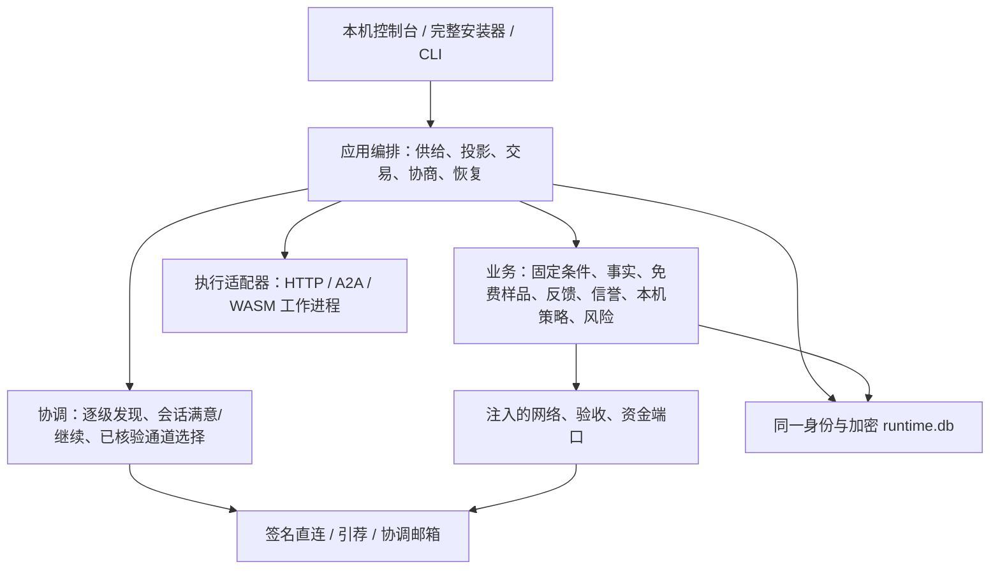

# 愿景逐项实现记录

日期：2026-10-06。业务目标见 [业务设计](VISION-BUSINESS-DESIGN.md)，分层及协议见 [架构设计](VISION-ARCHITECTURE-DESIGN.md)。

本记录区分代码能力、隔离节点验证和现网部署。没有真实收付款通道时，不把收费、退款或创作者分成记为成功。

## 1. 实现范围

| 批次 | 已实现的代码能力 | 仍需兑现的部分 |
|---|---|---|
| B0 交易事实 | 双方、供给和原任务号组成稳定交易 UID；技术交付、质量、支付、退款、异议分别记录；入队/执行/投影持久化；并发买方相同任务号隔离；旧记录保持原编号 | 外部 Agent 无幂等或查询接口时，结果 UNKNOWN 仍需人工处理 |
| B1 样品与体验 | 接单前固定免费资格；真实交付计数；首批 10 个固定槽位；并发边界超额单独归档；双边反馈、安全公共投影、签名锚点、撤回、来源与修订；有界多源查询及 NAT 元数据邮箱 | 真实用户长期评价覆盖、反串谋效果与内容公开声明质量 |
| B2 信誉 | 纯计算、多维度、衰减、同对手贡献封顶、旧版本折扣、自测排除；支持量/贡献/排除原因/输入快照可查 | 真实业务校准；默认影子运行不会自动启用限制 |
| B3 机会治理 | 本机策略版本与 CAS；新人展示探索；SHADOW/SUGGEST/ENFORCE_LOCAL；仅充分支持的新事实升级限制；保留显式解除路径；基础公共发现不受业务信誉开关影响 | 持续业务试点，验证误伤与恢复；没有全网统一惩罚 |
| B4 交易与协商 | 买方签名免费授权、供给方签名固定免费条件；风控预留/支付意图/UNKNOWN 对账接口；加密协商、显式接受与拒绝、送达重试；双方关闭异议；明确启动一次新关联交易补做 | 真实收费报价与资金编排、首个实际支付驱动、实际退款及创作者分成 |
| B5 完整安装 | 五包和 Python 运行时打入单文件；浏览器安装/离线恢复；当前用户常驻；独立口令便携备份；明确可信发布者的签名升级、备份、程序检查、保持同一 home、程序回退 | 正式发布者签名、普通用户新电脑安装试点；第五台公网服务器；公网 NAT/休眠/长期常驻验证 |
| B6 后期能力 | 可选重连授予、累计上限、不重排样品；签名 WASM 包、显式权限授权、独立受限工作进程、固定供给 ID、安装版本历史与回滚；私有文件分块、签名和加密读取、独立 NAT 文件邮箱、HTTP Range、整文件哈希；去元数据图像缩略图 | 公网 NAT 长期验证、流式生成/视频音频预览、更多执行后端、实际创作者分成 |

## 2. 唯一实现及分层

五个发行包保持 `a2n-kernel`、`a2n-p2p`、`a2n-acceptance`、`a2n-sdk`、`a2n-node`。全功能安装产品以 `a2n-node` 为装配根，依赖免费的标准库 SDK 业务实现。没有第二套中心平台账本。

核心新增模块：SDK 的 `trade_facts`、`contracts`、`experience`、`reputation`、`policies`、`payments`、`resolutions`、`reconnect`、`agent_packages`、`assets`；节点的 `experience_gateway`、`metadata_mailbox`、`resolution_gateway`、`secure_metadata`、`rework_service`、`asset_service`、`asset_mailbox`、`backups`、`upgrades`、`package_runtime`、`wasm_worker`。

## 3. 交易与免费规则

1. 同一买方、供给和任务号重复请求读原结果；换内容产生冲突，不再次执行。
2. 不同买方可使用相同任务号：私有执行账本隔离，线上原任务号和交易 UID 保持稳定。
3. READY 可恢复；已执行却无确定结果不得通过恢复再提交。投影失败可从持久化完成事件修复。
4. 技术交付即记履历。验收拒绝或付款失败不抹掉交付。未知、失败和取消不占完成名额。
5. 接单时固定免费资格。首批完成位置固定为 1–10；并发边界仍享原免费条件，但放入 `INITIAL_OVERFLOW`，不替换首批位置。
6. 本机 owner 自测标为 `SELLER_SELF`；匿名公共兼容调用为 `UNVERIFIED_EXTERNAL`；二者不伪装成已验证独立交易。
7. 免费签名授权限定金额 0、准确双方/供给/版本/输入摘要；供给方接单条件签名并随交付返回。
8. 未声明价格或实际收费的 Agent 在试用结束后拒绝接单；不会调用完成后才突然收费。
9. 当前重连策略默认关闭。启用后依据本机核验通信间隔，24 小时间隔授予至多 5 次，初始及重连累计上限 30；未用完或 UNKNOWN 的授予不能叠加。该观察不证明物理网络断开。

## 4. 反馈与信誉边界

- 私有正文不会自动变成公开正文。公开需另填短评；匿名样品 ID 不泄露原任务号和买方 DID。
- 公共意见保留原作者签名、交易锚点、修订链、撤回及出处；来源冲突隔离，不静默挑好评。
- 信誉只采用有资格且未撤回的最新意见；同一对手贡献有上限，不从多个缓存重复计权。
- 本机展示支持量、可信度、维度估计和排除理由；来源覆盖不完整不显示“全网无差评”。
- 信誉计算默认影子模式。启用本机机会限制需明确设置，不发布全网封禁名单，不限制基础发现义务。
- 节点身份不等于独立自然人；算法有界防刷不能消除多身份串谋。

## 5. 协商结果

协商消息是 `a2n-resolution-message/1`，交易双方签名；直连和 NAT 元数据邮箱使用独立 X25519/AES-GCM 加密。

- `REPLY`：解释；`PROPOSAL`：退款、补做或关闭；`ACCEPT`/`REJECT`：绑定完整方案哈希。改意愿须提出新方案，不覆盖原签名。
- 对方签名收件确认与接受方案分开记录。暂未送达有退避和手动重试入口。
- `CLOSE` 双方接受后各自在本机关闭该交易的未结异议；原交付、原评价与原异议正文保留。
- `REWORK` 双方接受后，由买方明确启动原供给版本、原输入的一次新任务。新任务 ID 由方案及原交易确定；重复启动取原结果，不能换输入套取额外执行。原条件变化则拒绝，需新协商。
- `REFUND` 只保存方案与同意；没有实际渠道核验，不记退款完成、不改到账事实。

## 6. 文件与 Agent 包

### 私有文件

- 管理接口原始流上传；单文件 16 MiB、总容量 128 MiB、128 个文件、至多 2 个上传/下载并发。
- 分片 64 KiB，全部由现有加密账本封存；上传未完成不能读，失败清理预留，启动清理中断上传。
- Agent 可返回 `{"assets":[asset_ref]}`，仅已验证交付给确切买方的本机文件引用产生读取授权。
- 跨节点 `a2n-assets/1` 读取逐片验签、加密，最终核验整文件摘要。直连不可用时，经 `a2n-asset-mailbox/1` 转送原签名请求及加密响应；无需重新执行 Agent，不利用协调或元数据邮箱搬原文件。
- 文件转送沿用可选服务字段 `blob_cache`，默认关闭，现版本只在内存短暂转送密文，不做持久缓存。独立队列最多 32 个租约、每节点 2 个及全局 8 个待处理请求；每分钟全局 32 MiB/单请求者 16 MiB（原始分片预算），512/256 次转送；租约 90 秒。分片最多 64 KiB，整次下载最多 120 秒，身份/交易/分片和整文件摘要均校验。加密和 JSON 编码会增加实际网络流量。
- 文件服务关闭或额度耗尽不改变基础发现及私有协商的额度；转送方不能核验明文摘要，由交易接收方核验。
- 管理下载支持单段 HTTP Range、强制附件和 `nosniff`；不自动下载任意结果 URL 或读取任意结果路径。
- 双方同意安全公开后，只对上限内的 PNG/JPEG/WebP 解码生成新的 RGB PNG 缩略图，去除 EXIF、文本和配置，尺寸 ≤192，单图 ≤8 KiB。视频、音频及不能处理的图像保留公开槽位占位。

### WASM 包

包协议 `a2n-agent-package/1`，执行 ABI `a2n-wasm-json/1`。签名模块上限 256 KiB，明确授权精确预览摘要；代码在独立子进程执行，只提供 `a2n.read_input`、`a2n.write_output`。

限制包括输入、输出、线性内存、fuel、栈和执行时间；不提供 WASI、网络、文件和环境接口。编译过程并未设置操作系统级 RSS 硬限，不能把所有运行时缺陷风险说成已消除。

同一发布者/package_id 使用固定供给 ID。更新和回滚保留履历；安装默认未上架。创作者分成字段只保存约定，没有实际付款。

## 7. 安装、恢复与签名升级

- `artifacts/A2N.exe` 打包五包、控制台、Python、加密、WASM 与图像依赖。开发产物尚无正式发布签名。
- 双击打开回环安装/恢复页面；沿用明确的节点数据目录；登录启动使用当前用户、同一目录和端口；应用虚拟化目录中的程序保存物理绝对路径，避免旧计划任务误回源码入口。
- 便携备份用独立口令重新封存全部记录和密钥；实际恢复必须停机。不同已有身份需显式允许替换；网络配置恢复是独立选项。
- 升级协议 `a2n-release/1`：作者签名，Windows/A2N.exe、大小、SHA256、递增发布序列及兼容数据库 schema=2。首先在本机明确可信发布者，无隐含全球信任。
- 准备升级导出并完整验证备份、核验和复制不可变程序；应用时先用隔离目录检查新运行时，再停止旧节点、切换安装、自启动与程序，核对原 DID 和监听进程的完整程序摘要；同一身份的旧监督程序抢占端口也不能被记成升级成功。
- 失败尝试恢复旧程序路径。异常终止在 QUEUED/APPLYING 时的自动状态恢复仍待补强；数据库没有自动回退；若新版数据不兼容，使用已经导出的备份离线恢复。
- Linux 使用全套源码安装与 systemd，Windows 使用单文件；其业务和数据库实现相同。

## 8. 管理接口索引

管理接口均要求本机/配对凭据；公共协议使用节点签名与限流。

| 领域 | 接口 |
|---|---|
| 事实 | GET `/v1/trades`、`/v1/trades/{uid}` |
| 体验 | POST `/v1/experience/queries`、GET 查询、POST `/v1/feedback/publications` |
| 信誉/本机策略 | POST `/v1/reputation/rebuild`、GET `/v1/reputation`、PUT `/v1/policies/{id}` + If-Match |
| 风险/对账 | GET `/v1/risk`、PUT + If-Match、GET `/v1/payments`、POST `/v1/payments/{id}/reconcile` |
| 协商 | POST/GET `/v1/disputes/{id}/messages`、POST `agreements`、`decisions`；POST `/v1/resolutions/retry`、`rework` |
| 文件 | POST 原始流 `/v1/assets/upload`、POST `/v1/assets/fetch`、GET `/v1/assets/{id}/content` |
| 恢复 | POST `/v1/backups`、POST `/v1/restores/validate`；离线安装器或 restore CLI |
| 升级 | POST `/v1/upgrades/trust`、`preview`、`prepare`、`apply` |
| 重连 | POST `/v1/reconnect/policy` + expected_revision |
| Agent 包 | POST `/v1/packages/preview`、`install`、`rollback`；仍用原供给接口上下架 |

## 9. 验证和剩余依赖

新增集成测试使用隔离的真实 Daemon、签名身份、HTTP 调用及真实 WASM 执行；不以演示数据冒充交付。旧加密账本、旧入口与模块边界继续回归。最终计数与运行验收结果记录在 `artifacts/VISION-DELIVERY-2026-10-06.md`。

尚需用户提供可使用的收付款通道及测试账户配置（密钥留在本机），才能落实实际收费、退款和分成。远端 SSH 此前 TCP 可连但服务主动关闭连接，尚不能把第五节点计为安装成功。公网和新设备试点仍需实际环境参与。以上限制不影响已经贯通的免费交易流程。
