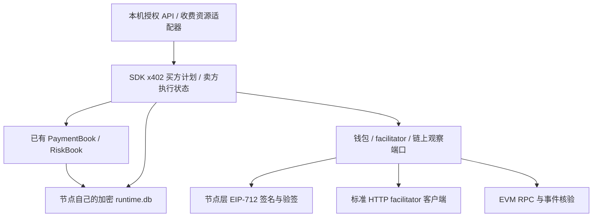

# x402 标准支付模块

更新：2026-10-07。实现范围：x402 v2、HTTP、EVM `exact`、EIP-3009、EOA 钱包、`authorization` 流程。

## 1. 对等市场中的职责

买方自己批准付款和控制额度，卖方提供收款地址；代为结算的 facilitator 验证授权并广播链上交易。转账金额直接进入授权指定的卖方地址。A2N 不持有买卖双方资金、不收平台佣金，不内置一个必经的支付平台。

每个部署者可选择自己信任的 RPC 和标准 facilitator，包括自托管 facilitator。这个模块提供 facilitator 的客户端适配器，并不内置持有 gas 钱包的 facilitator 服务；自托管服务可使用官方实现。节点发现的公共服务义务不等于必须为其他人的付款支付 gas。

付款、技术交付、质量评价、退款各自记录。付款成功不能推出交付成功，更不能推出质量满意。HTTP 200 也不能单独证明付款成功。

这是可单独接入的支付模块，并已接入本机支付意图和额度账本。现有 Agent 市场合同仍为 `FREE_ONLY`；本次没有把免费调用改成收费调用。前 10 次免费技术交付仍然必须成为公开样品。后续收费合同接入时，应复用本模块，而不是再创建资金账本。

## 2. 标准边界

对照官方规范：

- [x402 v2](https://github.com/x402-foundation/x402/blob/main/specs/x402-specification-v2.md)
- [HTTP 传输](https://github.com/x402-foundation/x402/blob/main/specs/transports-v2/http.md)
- [exact EVM](https://github.com/x402-foundation/x402/blob/main/specs/schemes/exact/scheme_exact_evm.md)
- [ERC-3009](https://eips.ethereum.org/EIPS/eip-3009)

| 项目 | 模块行为 |
| --- | --- |
| 协议版本 | `x402Version: 2`；不把 v1 请求默认为 v2 |
| 请求付款 | HTTP 402，`PAYMENT-REQUIRED`，Base64 JSON |
| 授权付款 | `PAYMENT-SIGNATURE`，Base64 JSON |
| 结算结果 | `PAYMENT-RESPONSE`，Base64 JSON |
| 网络 | CAIP-2，例如 `eip155:84532`；按部署配置绑定 |
| 金额 | 正整数字符串，代币最小单位；禁止浮点换算 |
| 转账 | EIP-3009 `TransferWithAuthorization` 的 EIP-712 签名 |
| 流程 | 验证 → 执行业务 → 结算 → 响应 |
| facilitator | `GET /supported`、`POST /verify`、`POST /settle` |
| 查询付款 | 通过配置的链上 RPC 核验；不虚构 x402 `/query` 标准接口 |
| 扩展 | 保留并校验信息的回传；不声称执行未实现的扩展 |

当前拒绝 `upto`、Permit2、ERC-7710、Solana、智能合约钱包签名、`upfront`、`escrow`。它们需要各自适配器，不能通过改一个字符串启用。解析器另外设有 8 KiB 协议头、1 MiB 请求及结果、最长 3600 秒授权等本地上限。

## 3. 分层与模块



SDK `a2n_sdk.x402` 保持零第三方依赖：

- `protocol.py`：标准数据、编解码、边界校验。
- `ports.py`：钱包、签名验证、facilitator、链上观察接口。
- `client.py`：明确批准的请求计划，绑定既有付款意图和风险预留。
- `server.py`：收费资源状态机及持久化防重复执行。

节点层 `a2n_node.x402`：

- `http.py`：有大小和超时上限的 HTTP；禁止付款授权跟随重定向。
- `evm.py`：真实 EIP-712 签名、签名恢复、链上回执和授权事件验证。
- `service.py`：配置、钱包注入、PaymentDriver 适配和本机 API 装配。

钱包加密文件由 `eth-account` 解密；运行中使用私钥签名。SDK 不读私钥。新依赖由桌面、Docker、Linux 和源码安装入口包含；产品 doctor 会执行离线签名/验签检查。

## 4. 买方规则

1. 读取资源的 402 响应，只读取请求，不自动付款。
2. 买方明确批准其中一个完整报价，包括链、代币、EIP-712 域、金额、收款地址、资源 URL 和请求输入。
3. 配置资产白名单必须匹配。币种名称只用于本机预算分类，不能代替链和合约地址。同一个币种预算键只允许对应一个链上资产。
4. 创建一个 `PaymentBook` 意图并预留风险额度；请求输入及报价一同原子持久化。风险上限缺失或超额时，不签名、不发支付请求。
5. 明确提交后，生成唯一随机授权 nonce。授权和观察起点先写入加密存储，随后才发送 HTTP 请求。
6. 每个意图最多向资源发送一次付款请求。超时、进程退出、响应异常进入 `UNKNOWN`。再次 submit 不再次调用资源、不生成新授权。
7. reconcile 只读取链状态：网络、代币、付款人、收款人、金额、授权 nonce 必须匹配；还要核验规范区块及确认深度。
8. 匹配转账事件及 `AuthorizationUsed` 事件得到确认后，额度从 `ACTIVE` 转为 `CONSUMED`。
9. 确认深度覆盖的区块时间超过授权截止时间，扫描完整且链上授权未使用时，才确认失败并释放额度。单凭本机时间、HTTP 错误或一笔交易回滚，不释放仍可被花费的授权额度。

链上观察依赖部署者信任的 RPC 和所配确认深度，不是数学上不可逆的最终性证明。扫描最多覆盖 10000 个区块，分段读取；跨度超限、RPC 不可用或证据不完整时保留 `UNKNOWN`。长时间离线的历史查询需要扩展观察适配器，不能靠重新付款解决。

## 5. 卖方规则

`X402ResourceServer` 是可接任意 Python HTTP 框架的收费资源处理器。配置并复用一个处理器实例，传入共享的节点存储、facilitator、验签器、链上观察器和业务处理函数；不要每次请求重建状态服务。

未付款时，只有 facilitator 宣告支持的本模块报价才可对外返回。收到付款时，报价必须精确匹配，授权签名先验证，再由 facilitator 做余额/执行模拟等只读检查。通过检查后，才允许执行业务。

业务开始前写入 `EXECUTING`；成功结果先缓存进加密存储，再开始结算。失败的业务响应不触发结算。进程在业务或结算期间退出时，标为 `UNKNOWN`，不自动再次执行业务和结算。后续链上核验确认付款后，可恢复已经保存的结果；没有保存的结果不会凭付款成功推断出来。

链上授权签名和 nonce 可能在交易数据中公开，因此缓存结果恢复还要求同一个私有 `Idempotency-Key`。买方模块自动生成并保存这个随机凭据，HTTP 框架应把它传给 `handle(..., replay_token=...)`。这是应用恢复凭据，不是新增 x402 标准字段。

不提供恢复凭据的标准客户端仍能完成首次付款调用；后续重复授权返回 409，不再次提供缓存内容。相同 nonce 换输入会被拒绝。该机制不能取消有效链上授权；卖方不履约仍需双方反馈或另行退款。

EIP-3009 签名本身绑定转账，不绑定业务输入或 DID。模块在本地绑定请求并默认使用 HTTPS；节点身份和钱包归属的证明应由后续双边收费合同明确签署。

## 6. 部署配置

默认不配置钱包、不自动扣款。卖方只做验签和查询时，无须提供买方钱包。

`A2N_X402_CONFIG` 指向配置 JSON。例如以下是 Base Sepolia 的 USDC 配置结构；填写自己信任的 RPC，核验网络及代币信息后使用：

```json
{
  "assets": [{
    "currency": "USDC",
    "network": "eip155:84532",
    "asset": "0x036CbD53842c5426634e7929541eC2318f3dCF7e",
    "name": "USDC",
    "version": "2",
    "rpc_url": "https://YOUR_TRUSTED_RPC",
    "confirmations": 3
  }],
  "timeout": 15,
  "allow_http": false
}
```

买方使用 `A2N_X402_KEYSTORE` 指向 Ethereum 加密钱包文件，通过 `A2N_X402_KEYSTORE_PASSWORD` 提供解密密码。程序还支持注入 `EvmSigner` 或符合端口的钱包适配器。配置错误会明确报错；不切换成其他支付方式。

`allow_http` 仅用于明确允许的本地测试环境；生产付款使用 HTTPS。配置及钱包路径不从公共报价读取。钱包密码、授权签名、完整请求输入不出现在公开发现或样品接口中。

真实支付前还需要有效代币余额、可信 RPC，以及卖方配置的 facilitator。facilitator 的 gas 支出及收费由使用双方自行约定；本模块不代付 gas、不自动退款，也不声称免除链上手续费。

## 7. 本机 API

全部接口使用既有本机管理认证。公开节点接口不开放钱包管理。

设置风险限额时，沿用 `If-Match` 请求头传入当前配置 revision；不是在请求体内传 expected_revision。未设置预算时，prepare 会拒绝创建付款意图。

| 方法与路径 | 行为 |
| --- | --- |
| `GET /v1/x402` | 实现范围、配置状态、资产与零佣金声明；不暴露 RPC 凭据 |
| `POST /v1/x402/prepare` | 批准报价并创建付款意图；仅预留额度 |
| `GET /v1/x402/intents/{intent_id}` | 付款事实与交付结果分别展示 |
| `POST /v1/x402/intents/{intent_id}/submit` | 明确提交一次付款调用 |
| `POST /v1/x402/intents/{intent_id}/reconcile` | 只读链上核验 |
| `PUT /v1/risk` | 沿用既有风险限额配置接口 |

prepare 请求字段：

```json
{
  "required_header": "原始 PAYMENT-REQUIRED 头",
  "accepted": {"完整": "所批准的 PaymentRequirements 对象"},
  "url": "https://卖方资源地址",
  "method": "POST",
  "body_base64": "原始业务请求的 Base64",
  "trade_uid": "双方约定的交易编号",
  "counterparty_did": "卖方节点 DID",
  "command_id": "本次批准的唯一编号"
}
```

同一交易的请求或报价变更会冲突；不会用同一个付款意图默默支付另一单。counterparty_did 是本机预算及交易引用，模块没有据此宣称已经证明钱包属于该 DID。

## 8. 验证与交付边界

`tests/test_x402_protocol.py` 验证线格式、拒绝不支持的方式、签名篡改及 ERC-3009 独立 ABI 摘要。

`tests/test_x402_module.py` 验证链上证据匹配、重组及确认深度、额度、加密重启、未知状态、重复授权、并发、重定向与真实 HTTP 协议往返。HTTP 测试中的链数据和 facilitator 是可控测试夹具，没有发送真实链上交易。

`scripts/check_x402_interop.py` 对照官方 Python SDK 2.25.0，双向检查三种协议头、官方 EIP-3009 摘要和官方客户端签名。参考 SDK 安装到独立测试目录，不成为 A2N 产品运行依赖。

生产钱包与真实链上付款未配置、未验证。这和模块的协议及状态测试分别记录。下一步市场接入包括：双方签署收费合同、DID 与钱包归属绑定、上架报价与试用额度衔接、支付事实关联交易事实、双方另行授权退款。普通用户的钱包配置界面也尚未包含在本模块中。
